# FLUTTER + FIREBASE REALTIME-DATABASE

Aplikasi **Flutter** yang terintegrasi dengan **Firebase Realtime Database (RTDB)**.

## Daftar Isi

1. [Prasyarat](#prasyarat)
2. [Membuat Project Firebase](#1-membuat-project-firebase)
3. [Membuat Realtime Database](#2-membuat-realtime-database)
4. [Mengatur Security Rules](#3-mengatur-security-rules)
5. [Membuat Struktur Data (Path)](#4-membuat-struktur-data-path)
6. [Menghubungkan Flutter ke Firebase](#5-menghubungkan-flutter-ke-firebase)
7. [Membaca Data Realtime di Flutter](#6-membaca-data-realtime-di-flutter)
8. [Menjalankan Aplikasi Di Web (Chrome/EDGE)](#menjalankan-aplikasi-di-web-chromeedge)

---

## Prasyarat

- Akun Google
- Flutter SDK terpasang (`flutter doctor` tanpa error)
- Editor (VS Code / Android Studio)
- Koneksi internet

---

## 1. Membuat Project Firebase

### Langkah 1 — Buka Firebase Console

1. Buka [https://firebase.google.com](https://firebase.google.com).
2. Login dengan akun Google, lalu klik **Buka konsol** (pojok kanan atas).

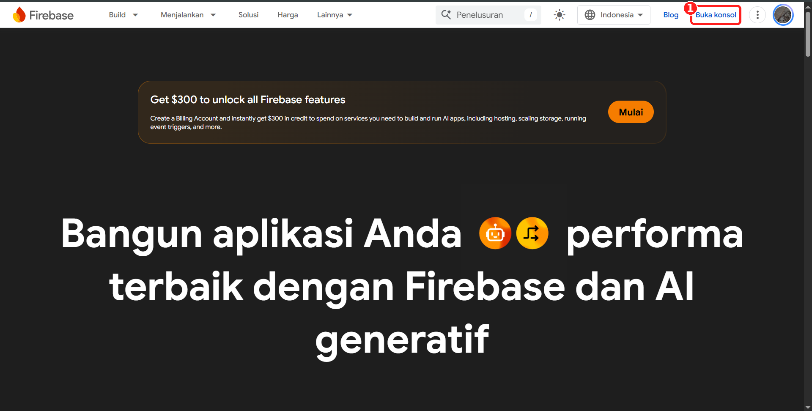

> Banner "Get $300 to unlock all Firebase features" **tidak perlu diklik**. Praktik ini cukup memakai paket gratis **Spark plan**.

### Langkah 2 — Buat Project Baru

Di halaman konsol, klik **Create a new Firebase project**.

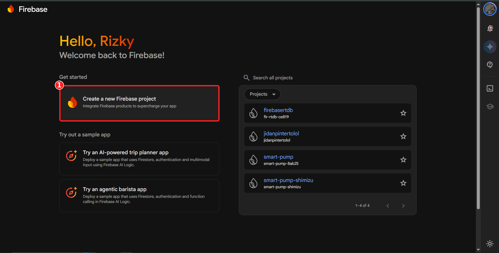

### Langkah 3 — Beri Nama Project

1. Isi **Project name**, pada contoh ini: `firebaserealtimedatabase`.
2. Firebase otomatis membuat **Project ID** unik (contoh: `fir-realtimedatabase-7a054`). ID ini bisa berbeda di akun masing-masing.
3. Klik **Continue**, lalu ikuti langkah berikutnya sampai project selesai dibuat. Opsi tambahan seperti Gemini atau Google Analytics tidak wajib untuk praktik ini.

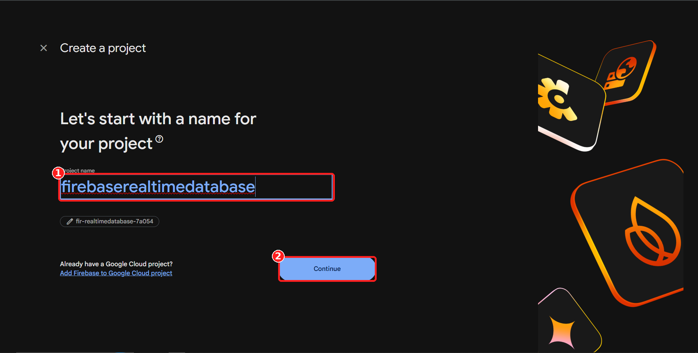

Setelah selesai, kamu akan masuk ke halaman **Project Overview** dengan label **Spark plan** (gratis, $0/bulan).

---

## 2. Membuat Realtime Database

### Langkah 4 — Buka Menu Realtime Database

Di sidebar kiri, pilih **Databases and storage** lalu klik **Realtime Database** (di bagian *NoSQL*).

> Jangan tertukar dengan **Firestore**. Keduanya sama-sama NoSQL, tetapi contoh ini memakai **Realtime Database**.

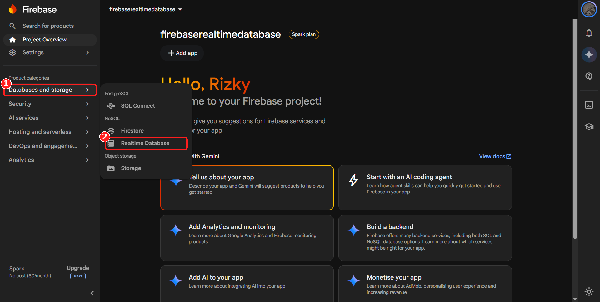

### Langkah 5 — Create Database

Klik tombol **Create Database**.

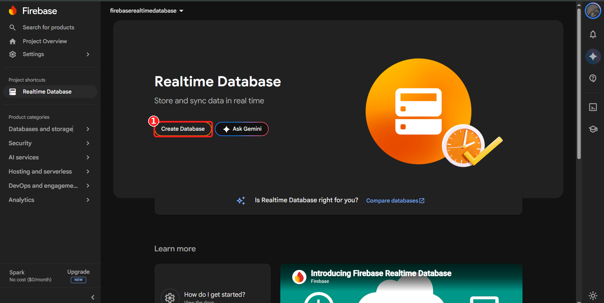

### Langkah 6 — Pilih Lokasi Database

Pada langkah **Database options**, pilih lokasi server. Untuk pengguna di Indonesia, pilih **Singapore (asia-southeast1)** karena paling dekat sehingga latensinya lebih rendah. Lalu klik **Next**.

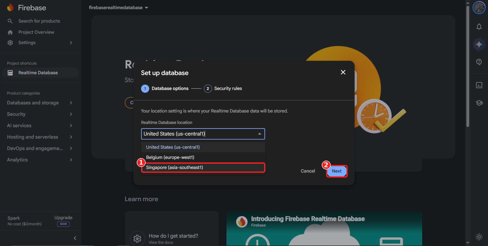

---

## 3. Mengatur Security Rules

### Langkah 7 — Pilih Mode Awal

Pada langkah **Security rules**, ada dua pilihan:

| Mode | Keterangan |
|------|------------|
| **Locked mode** | Semua akses dari client ditolak (`.read` dan `.write` bernilai `false`). Paling aman, tetapi aplikasi belum bisa membaca/menulis. |
| **Test mode** | Akses terbuka sementara. Aturan harus diperbarui dalam 30 hari. |

Pada contoh ini pilih **Start in locked mode**, lalu klik **Enable**. Rules akan diubah manual pada langkah berikutnya.

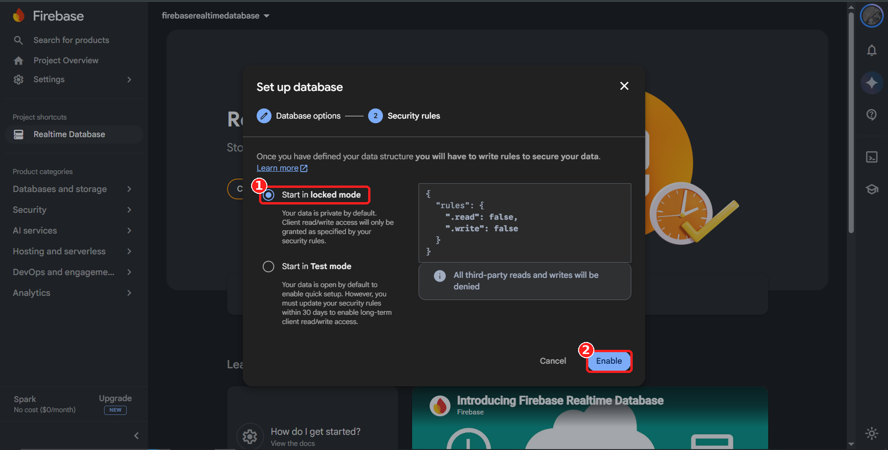

### Langkah 8 — Ubah Rules agar Bisa Dibaca/Ditulis (untuk Praktik)

1. Buka tab **Rules**.
2. Ubah isinya menjadi:

```json
{
  "rules": {
    ".read": true,
    ".write": true
  }
}
```

3. Klik **Publish** agar perubahan berlaku.

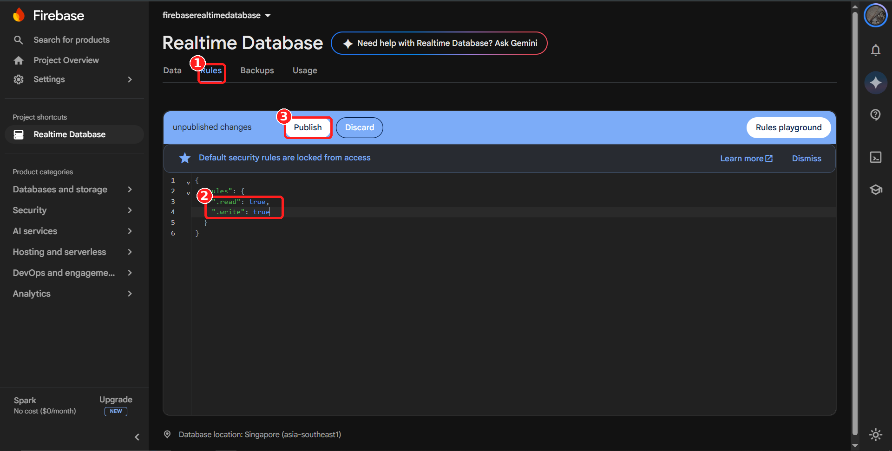

> ⚠️ **Peringatan keamanan**
> Rules di atas membuat database **terbuka untuk siapa saja** yang memiliki URL-nya. Gunakan hanya untuk **belajar dan pengujian**. Untuk proyek akhir yang sesungguhnya, tambahkan **Firebase Authentication** dan batasi akses, misalnya:
>
> ```json
> {
>   "rules": {
>     ".read": "auth != null",
>     ".write": "auth != null"
>   }
> }
> ```

---

## 4. Membuat Struktur Data (Path)

### Langkah 9 — Tambah Data Manual

1. Buka tab **Data**.
2. Klik ikon **+** di samping URL database.
3. Isi **Key** dan **Value**, lalu klik **Add**.
4. Ulangi untuk setiap path yang dibutuhkan.

Catatan: **URL database** (contoh: `https://fir-realtimedatabase-7a054-default-rtdb.asia-southeast1.firebasedatabase.app`) akan dipakai pada aplikasi Flutter, jadi salin dan simpan.

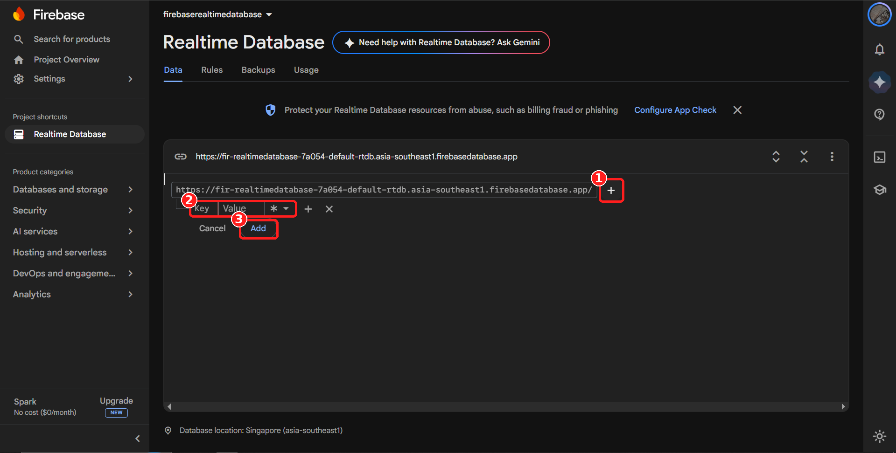

### Langkah 10 — Hasil Struktur Data

Buat tiga path berikut dengan nilai awal `0`:

| Key | Value | Contoh Kegunaan |
|-----|-------|-----------------|
| `DataSuhu` | `0` | Suhu dari sensor |
| `DataKelembaban` | `0` | Kelembaban udara |
| `DataTanah` | `0` | Kelembaban tanah |

Struktur JSON-nya:

```json
{
  "DataSuhu": 0,
  "DataKelembaban": 0,
  "DataTanah": 0
}
```

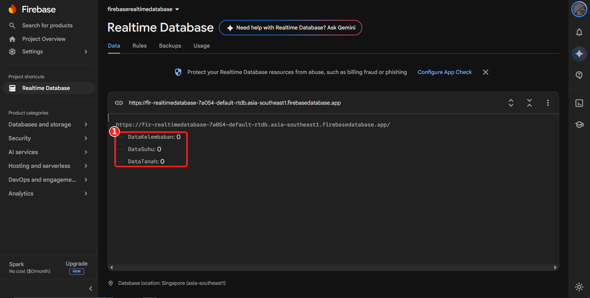

**Cara menguji:** klik value pada salah satu path (misalnya `DataSuhu`), ubah angkanya (misalnya menjadi `30`), lalu tekan Enter. Nilai ini nantinya akan langsung berubah di aplikasi Flutter tanpa perlu refresh.

---

## 5. Menghubungkan Flutter ke Firebase

Pada bagian ini project Flutter dihubungkan ke project Firebase yang sudah dibuat, menggunakan **Firebase CLI** dan **FlutterFire CLI**. Semua perintah diketik di **terminal VS Code** (`Ctrl + `` ` ``), kecuali Langkah 11 yang bisa memakai Command Prompt (CMD).

> ⚠️ **Penting:** pastikan **Realtime Database sudah dibuat** (Bagian 2–4) *sebelum* menjalankan `flutterfire configure`. Jika belum, `databaseURL` tidak akan ikut tertulis di file konfigurasi dan harus mengulang proses ini.

### Langkah 11 — Cek Node.js

Firebase CLI membutuhkan **Node.js**. Buka **Command Prompt** (tekan `Win + R`, ketik `cmd`, Enter), lalu jalankan:

```bash
node -v
```

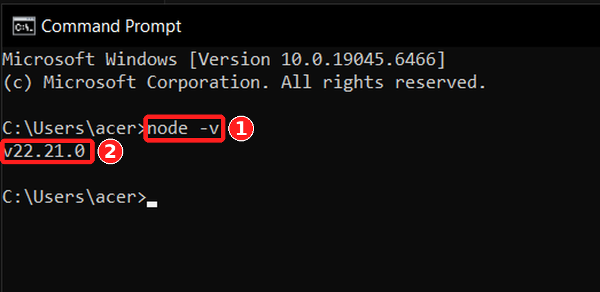

- Jika muncul nomor versi (contoh: `v22.21.0`), Node.js sudah terpasang. Lanjut ke Langkah 12.
- Jika muncul pesan `'node' is not recognized as an internal or external command`, Node.js belum terpasang:
  1. Download versi **LTS** di [https://nodejs.org/en/download](https://nodejs.org/en/download).
  2. Jalankan installer dan ikuti langkahnya sampai selesai (biarkan opsi bawaan).
  3. **Tutup lalu buka kembali** CMD/VS Code, kemudian ulangi `node -v`.

### Langkah 12 — Install Firebase CLI

Di terminal project VS Code, jalankan:

```bash
npm install -g firebase-tools
```

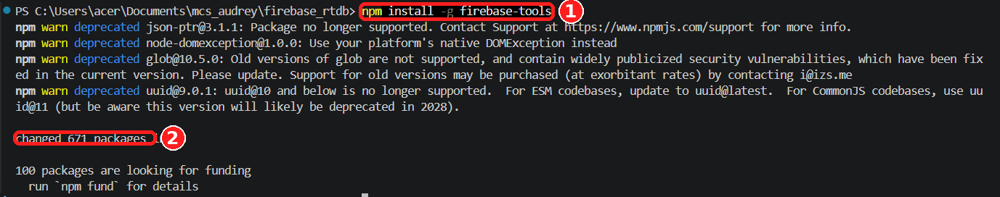

Tunggu sampai muncul pesan `changed ... packages`. Peringatan `npm warn deprecated` boleh diabaikan.

### Langkah 13 — Login ke Firebase

Jalankan:

```bash
firebase login
```

Terminal akan menanyakan dua hal (boleh dijawab **No**), lalu membuka browser untuk login.

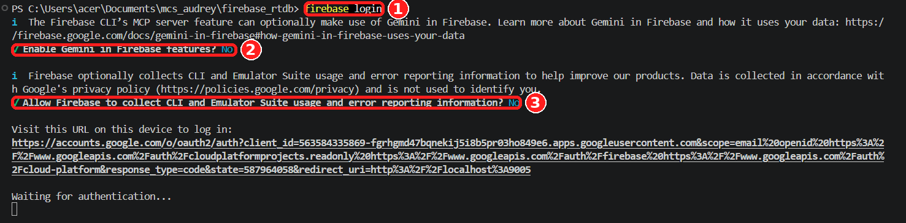

> Jika browser tidak terbuka otomatis, salin URL yang muncul di terminal lalu buka manual di browser.

Di browser:

1. **Pilih akun** Google, gunakan akun yang **sama** dengan yang dipakai membuat project Firebase.

   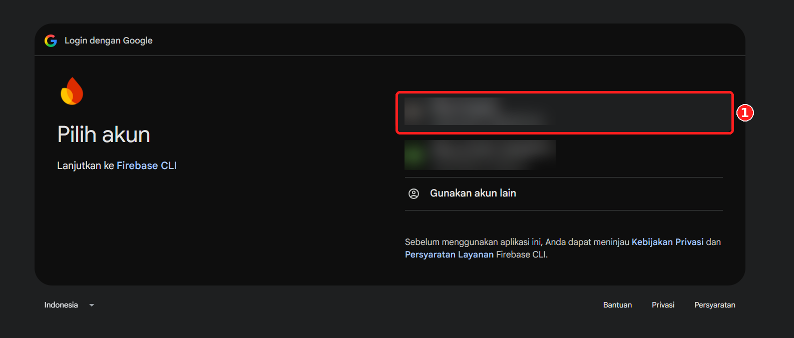

2. Klik **Lanjutkan**.

   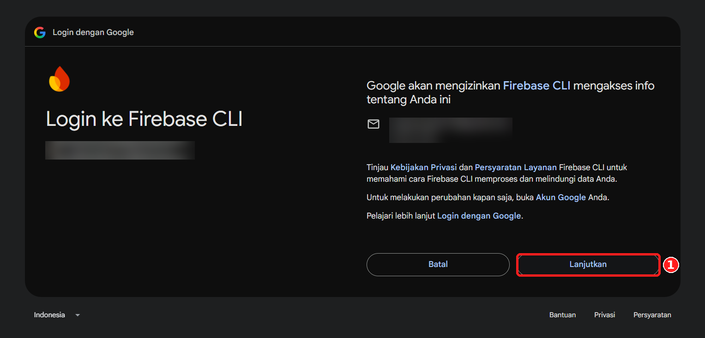

3. Klik **Izinkan** agar Firebase CLI boleh mengakses akun.

   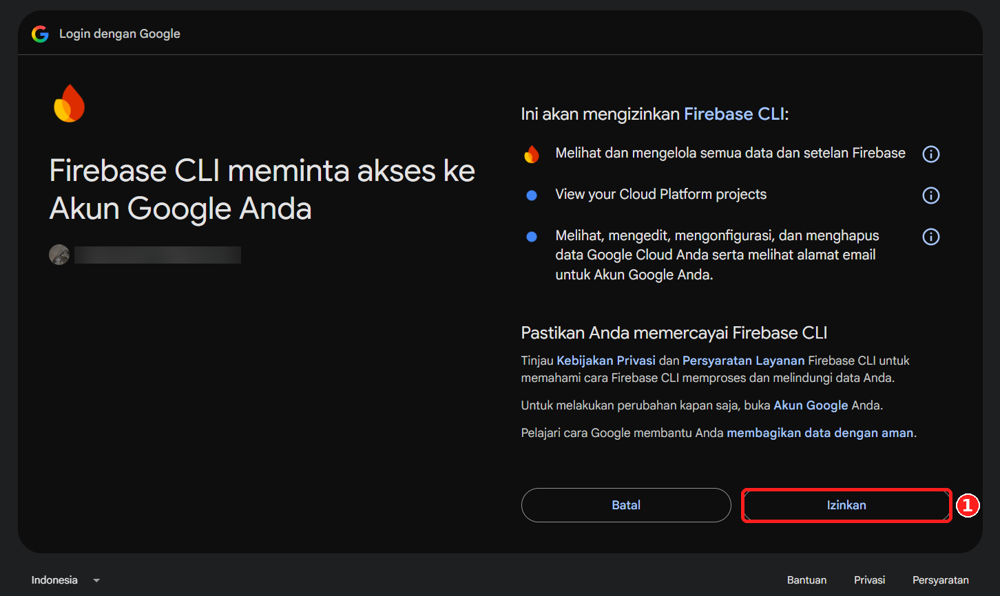

4. Jika muncul tulisan **Firebase CLI Login Successful**, login berhasil. Tab browser boleh ditutup dan kembali ke VS Code.

   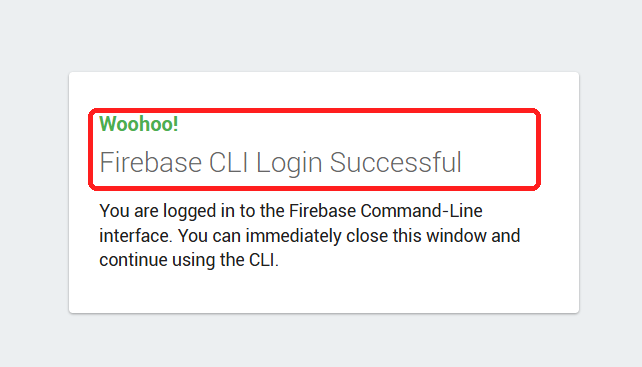

### Langkah 14 — Install FlutterFire CLI

Jalankan:

```bash
dart pub global activate flutterfire_cli
```

> Jika nanti muncul error `flutterfire is not recognized`, tambahkan folder `C:\Users\<nama-user>\AppData\Local\Pub\Cache\bin` ke **Environment Variables → Path**, lalu buka ulang VS Code.

### Langkah 15 — Jalankan `flutterfire configure`

Pastikan posisi terminal berada di **root project Flutter** (satu folder dengan `pubspec.yaml`), lalu jalankan:

```bash
flutterfire configure
```

1. Jika muncul pertanyaan *"You have an existing `firebase.json` file ... reuse the values?"*, pilih **no**. Pertanyaan ini hanya muncul bila project sebelumnya sudah pernah dikonfigurasi.
2. Pilih project Firebase yang tadi dibuat (pada contoh ini: `fir-realtimedatabase-7a054`) dengan **panah atas/bawah**, lalu tekan **Enter**.

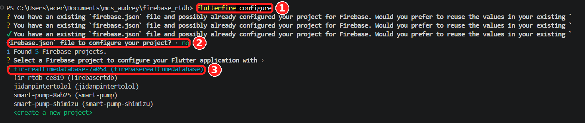

### Langkah 16 — Pilih Platform

Pada pertanyaan *"Which platforms should your configuration support?"*, pilih **web** saja karena aplikasi contoh ini dijalankan di **Chrome/Edge**:

- Gerakkan kursor dengan **panah atas/bawah**.
- Tekan **Spasi** pada `web` sampai muncul tanda centang ✓.
- Tekan **Enter** untuk melanjutkan.

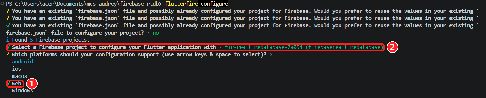

> Ingin menjalankan di Android atau platform lain? Ulangi `flutterfire configure` dan centang platform tersebut.

### Langkah 17 — Tambahkan Package `firebase_core`

File yang dihasilkan memakai package `firebase_core`, jadi pastikan sudah terpasang:

```bash
flutter pub add firebase_core
```

### Langkah 18 — Hasil: `firebase_options.dart`

Setelah proses selesai, akan muncul file baru **`firebase_options.dart`** di folder `lib/`.


Isi file (nilai `apiKey`, `appId`, dan `messagingSenderId` pada contoh ini disamarkan, milik kamu akan berbeda):

```dart
// File generated by FlutterFire CLI.
// ignore_for_file: type=lint
import 'package:firebase_core/firebase_core.dart' show FirebaseOptions;
import 'package:flutter/foundation.dart'
    show defaultTargetPlatform, kIsWeb, TargetPlatform;

/// Default [FirebaseOptions] for use with your Firebase apps.
///
/// Example:
/// ```dart
/// import 'firebase_options.dart';
/// // ...
/// await Firebase.initializeApp(
///   options: DefaultFirebaseOptions.currentPlatform,
/// );
/// ```
class DefaultFirebaseOptions {
  static FirebaseOptions get currentPlatform {
    if (kIsWeb) {
      return web;
    }
    switch (defaultTargetPlatform) {
      case TargetPlatform.android:
        throw UnsupportedError(
          'DefaultFirebaseOptions have not been configured for android - '
          'you can reconfigure this by running the FlutterFire CLI again.',
        );
      case TargetPlatform.iOS:
        throw UnsupportedError(
          'DefaultFirebaseOptions have not been configured for ios - '
          'you can reconfigure this by running the FlutterFire CLI again.',
        );
      case TargetPlatform.macOS:
        throw UnsupportedError(
          'DefaultFirebaseOptions have not been configured for macos - '
          'you can reconfigure this by running the FlutterFire CLI again.',
        );
      case TargetPlatform.windows:
        throw UnsupportedError(
          'DefaultFirebaseOptions have not been configured for windows - '
          'you can reconfigure this by running the FlutterFire CLI again.',
        );
      case TargetPlatform.linux:
        throw UnsupportedError(
          'DefaultFirebaseOptions have not been configured for linux - '
          'you can reconfigure this by running the FlutterFire CLI again.',
        );
      default:
        throw UnsupportedError(
          'DefaultFirebaseOptions are not supported for this platform.',
        );
    }
  }

  static const FirebaseOptions web = FirebaseOptions(
    apiKey: 'YOUR_API_KEY',
    appId: 'YOUR_APP_ID',
    messagingSenderId: 'YOUR_MESSAGING_SENDER_ID',
    projectId: 'fir-realtimedatabase-7a054',
    authDomain: 'fir-realtimedatabase-7a054.firebaseapp.com',
    databaseURL: 'https://fir-realtimedatabase-7a054-default-rtdb.asia-southeast1.firebasedatabase.app',
    storageBucket: 'fir-realtimedatabase-7a054.firebasestorage.app',
  );
}
```

### Penjelasan Kode `firebase_options.dart`

> File ini **dibuat otomatis** oleh FlutterFire CLI. Jangan diedit manual. Jika ada yang salah atau ingin menambah platform, jalankan ulang `flutterfire configure`.

#### 1. Komentar dan import (baris atas)

```dart
// ignore_for_file: type=lint
import 'package:firebase_core/firebase_core.dart' show FirebaseOptions;
import 'package:flutter/foundation.dart'
    show defaultTargetPlatform, kIsWeb, TargetPlatform;
```

| Baris | Fungsi |
|-------|--------|
| `// ignore_for_file: type=lint` | Mematikan peringatan *lint* (gaya penulisan) di file ini karena kodenya dibuat mesin. |
| `FirebaseOptions` | Kelas dari `firebase_core` yang menyimpan semua data identitas project Firebase. |
| `kIsWeb` | Bernilai `true` jika aplikasi berjalan di browser. |
| `defaultTargetPlatform` | Memberi tahu platform tempat aplikasi berjalan (Android, iOS, Windows, dan seterusnya). |
| `TargetPlatform` | Daftar nama platform yang dipakai untuk pencocokan di `switch`. |

#### 2. Kelas `DefaultFirebaseOptions`

```dart
class DefaultFirebaseOptions {
  static FirebaseOptions get currentPlatform { ... }
}
```

Kelas ini adalah "pintu masuk" konfigurasi. Bagian yang dipanggil dari `main.dart` adalah **`currentPlatform`**, yang otomatis memilih konfigurasi sesuai platform tempat aplikasi berjalan.

#### 3. Logika pemilihan platform

```dart
if (kIsWeb) {
  return web;
}
switch (defaultTargetPlatform) {
  case TargetPlatform.android:
    throw UnsupportedError(...);
  ...
}
```

- Jika aplikasi berjalan di **web** (`kIsWeb == true`), maka mengembalikan konfigurasi `web`.
- Jika berjalan di platform lain, kode masuk ke `switch`. Karena pada Langkah 16 hanya **web** yang dipilih, platform lain (Android, iOS, macOS, Windows, Linux) akan **melempar `UnsupportedError`** berisi pesan bahwa platform itu belum dikonfigurasi.
- Itu sebabnya aplikasi ini hanya bisa dijalankan di Chrome/Edge. Jika dijalankan di Android, akan muncul error tersebut.

#### 4. Konfigurasi `web`

```dart
static const FirebaseOptions web = FirebaseOptions(
  apiKey: '...',
  appId: '...',
  messagingSenderId: '...',
  projectId: '...',
  authDomain: '...',
  databaseURL: '...',
  storageBucket: '...',
);
```

| Properti | Penjelasan |
|----------|------------|
| `apiKey` | Kunci API untuk mengidentifikasi aplikasi web kamu ke layanan Firebase. |
| `appId` | ID unik aplikasi web yang terdaftar di project Firebase. |
| `messagingSenderId` | ID pengirim untuk Firebase Cloud Messaging (notifikasi). Tidak dipakai di praktik ini, tapi tetap dibuat otomatis. |
| `projectId` | ID unik project Firebase (sama dengan yang tampil saat membuat project). |
| `authDomain` | Domain untuk Firebase Authentication. Belum dipakai selama belum memakai fitur login. |
| `databaseURL` | **Alamat Realtime Database.** Properti inilah yang paling penting di praktik ini, karena aplikasi memakainya untuk membaca/menulis data ke RTDB. |
| `storageBucket` | Lokasi penyimpanan file (Cloud Storage). Tidak dipakai di praktik ini. |

> Untuk praktik ini yang benar-benar dipakai adalah `projectId` dan **`databaseURL`**. Properti lain terisi otomatis dan boleh dibiarkan.

#### 5. Cara file ini dipakai

Nanti di `main.dart`, Firebase diinisialisasi dengan memanggil:

```dart
await Firebase.initializeApp(
  options: DefaultFirebaseOptions.currentPlatform,
);
```

Kode lengkapnya dibahas pada bagian [Membaca Data Realtime di Flutter](#6-membaca-data-realtime-di-flutter).

> ⚠️ **Catatan keamanan**
> `apiKey` pada Firebase Web bukan password, melainkan pengenal project, jadi aman berada di aplikasi. Namun, selama **Security Rules** masih `true` (Langkah 8), siapa pun yang tahu `databaseURL` bisa membaca dan menulis data. Gunakan hanya untuk belajar, dan batasi rules untuk proyek sungguhan.

---

### Troubleshooting Bagian Ini

| Masalah | Penyebab | Solusi |
|---------|----------|--------|
| `'node' is not recognized` | Node.js belum terpasang atau terminal belum di-restart | Install dari [nodejs.org](https://nodejs.org/en/download), lalu buka ulang terminal |
| `npm`/`firebase` ... *running scripts is disabled on this system* | Kebijakan PowerShell memblokir script | Jalankan `Set-ExecutionPolicy -Scope CurrentUser RemoteSigned`, lalu coba lagi |
| `firebase is not recognized` | Folder npm global belum masuk PATH | Tutup dan buka ulang VS Code. Jika masih gagal, cek `npm config get prefix` dan tambahkan ke PATH |
| `flutterfire is not recognized` | Folder Pub Cache belum masuk PATH | Tambahkan `%LOCALAPPDATA%\Pub\Cache\bin` ke PATH |
| Project tidak muncul saat `flutterfire configure` | Login dengan akun Google yang berbeda | Jalankan `firebase logout`, lalu `firebase login` dengan akun yang benar |
| `databaseURL` tidak ada di `firebase_options.dart` | Realtime Database belum dibuat saat configure | Buat RTDB dulu, lalu jalankan ulang `flutterfire configure` |

---

## 6. Membaca Data Realtime di Flutter

Pada bagian ini aplikasi dibangun untuk **menampilkan data suhu, kelembaban udara, dan kelembaban tanah** dari Firebase Realtime Database secara **realtime**. Saat nilai di RTDB berubah (misalnya lewat Firebase Console), tampilan aplikasi ikut berubah tanpa refresh.

### Alur Data

```
Firebase Realtime Database  (DataSuhu / DataKelembaban / DataTanah)
            │  onValue (stream)
            ▼
SensorService   → mengubah data RTDB menjadi Stream<double>
            │  listen()
            ▼
AppProvider     → menyimpan SensorModel, lalu notifyListeners()
            │  Consumer
            ▼
HomePage        → menampilkan 3 CustomReadField di layar
```

### Langkah 19 — Tambahkan Package

Jalankan perintah berikut di terminal VS Code (root project):

```bash
flutter pub add firebase_database
flutter pub add provider
flutter pub add google_fonts
```

> `firebase_core` sudah ditambahkan pada Langkah 17.

Setelah berhasil, bagian `dependencies` di `pubspec.yaml` akan berisi package tersebut (nomor versi bisa berbeda pada tiap waktu):

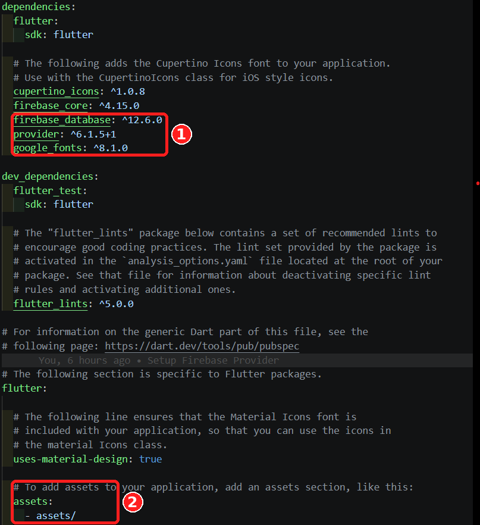

#### Fungsi masing-masing package

| Package | Fungsi di proyek ini |
|---------|----------------------|
| `firebase_core` | Package dasar Firebase. Wajib dipanggil lebih dulu (`Firebase.initializeApp`) sebelum layanan Firebase lain dipakai. |
| `firebase_database` | Library untuk **Realtime Database**. Dipakai untuk membaca data lewat *stream* (`onValue`) dan, jika dibutuhkan, menulis data. |
| `provider` | Library **state management**. Dipakai agar data sensor disimpan di satu tempat (`AppProvider`) dan semua halaman otomatis ter-update saat data berubah. |
| `google_fonts` | Memudahkan pemakaian font dari Google Fonts (pada contoh ini font **Roboto**) tanpa harus mengunduh dan mendaftarkan file font manual. Butuh internet saat font pertama kali dimuat. |

### Langkah 20 — Aktifkan Assets (Gambar)

Gambar ikon sensor disimpan di folder `assets`. Agar Flutter bisa memakainya, folder itu harus didaftarkan di `pubspec.yaml`.

**1. Download gambarnya**

Gambar tersedia di folder `assets` pada repositori ini:
[https://github.com/WhyoouSm1Le/FIREBASE-REALTIMEDATABASE/tree/main/assets](https://github.com/WhyoouSm1Le/FIREBASE-REALTIMEDATABASE/tree/main/assets)

- Klik tiap file gambar, lalu klik ikon **Download raw file** (⬇) di pojok kanan atas, **atau**
- Klik **Code → Download ZIP** di halaman utama repositori, ekstrak, lalu ambil isi folder `assets`.

**2. Taruh di project Flutter**

Buat folder `assets` di **root project** (sejajar dengan `pubspec.yaml`, bukan di dalam `lib`), lalu masukkan gambar berikut dengan nama file yang **persis sama**:

```
assets/
├── thermometer.png
├── humidity_sensor.png
└── soil_analysis.png
```

**3. Daftarkan di `pubspec.yaml`**

Pada bagian `flutter:`, tambahkan (lihat kotak ② pada gambar di atas):

```yaml
flutter:
  uses-material-design: true

  assets:
    - assets/
```

> ⚠️ YAML sangat sensitif terhadap **spasi/indentasi**. `assets:` harus sejajar dengan `uses-material-design`, dan `- assets/` menjorok **2 spasi** ke dalam. Gunakan spasi, bukan Tab.
>
> Tanda `/` di akhir (`assets/`) berarti **semua file** di dalam folder tersebut ikut terdaftar.

Simpan file. VS Code biasanya menjalankan `flutter pub get` otomatis. Jika tidak, jalankan manual:

```bash
flutter pub get
```

### Langkah 21 — Buat Struktur Folder di `lib`

Di dalam folder `lib`, buat folder dan file `.dart` berikut:

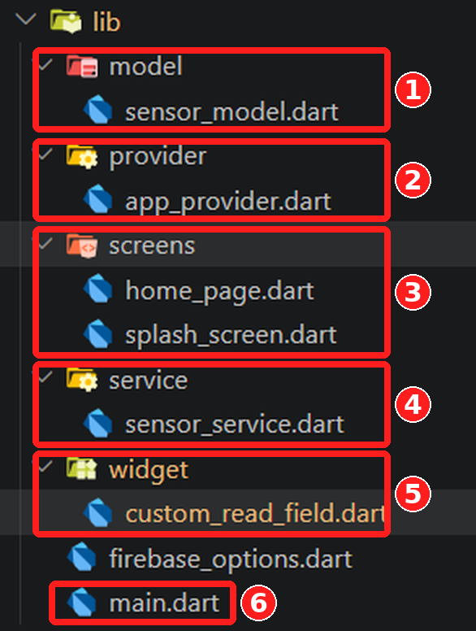

```
lib/
├── model/
│   └── sensor_model.dart
├── provider/
│   └── app_provider.dart
├── screens/
│   ├── home_page.dart
│   └── splash_screen.dart
├── service/
│   └── sensor_service.dart
├── widget/
│   └── custom_read_field.dart
├── firebase_options.dart      (dibuat otomatis oleh FlutterFire)
└── main.dart                  (sudah ada)
```

| Folder | Peran |
|--------|-------|
| `model` | Bentuk/struktur data (data apa saja yang dibawa). |
| `service` | Bagian yang berkomunikasi dengan Firebase. |
| `provider` | Penyimpan data dan penghubung antara *service* dan tampilan. |
| `widget` | Komponen UI kecil yang bisa dipakai berulang. |
| `screens` | Halaman-halaman aplikasi. |

Pemisahan ini membuat kode rapi: jika kelak ingin mengganti sumber data atau tampilan, cukup mengubah bagian yang bersangkutan.

> Urutan pengisian file di bawah dibuat dari yang paling dasar (model) sampai paling akhir (`main.dart`), sehingga tiap file hanya memanggil file yang sudah dibuat sebelumnya.

---

### Langkah 22 — `sensor_model.dart`

Berisi kelas **model** yang menyimpan satu set data sensor.

```dart
class SensorModel {
  final double temp;
  final double humidity;
  final double soil;

  SensorModel({
    this.temp = 0.0,
    this.humidity = 0.0,
    this.soil = 0.0,
  });

  SensorModel copyWith({
    double? temp,
    double? humidity,
    double? soil,
  }) {
    return SensorModel(
      temp: temp ?? this.temp,
      humidity: humidity ?? this.humidity,
      soil: soil ?? this.soil,
    );
  }
}
```

#### Penjelasan

- **`class SensorModel`** adalah "wadah" data. Satu objek `SensorModel` merepresentasikan pembacaan ketiga sensor sekaligus.
- **`temp`, `humidity`, `soil`** masing-masing menyimpan suhu, kelembaban udara, dan kelembaban tanah dalam tipe `double` (bilangan desimal).
- **`final`** artinya nilai tidak bisa diubah setelah objek dibuat (*immutable*). Jika ada data baru, yang dibuat adalah objek baru, bukan mengubah yang lama.
- **Constructor dengan `this.temp = 0.0`** memberi **nilai awal 0.0**. Jadi `SensorModel()` tanpa parameter langsung berisi `0.0` untuk semua sensor. Ini nilai yang tampil di layar sebelum data dari Firebase tiba.
- **`copyWith`** membuat **salinan** objek dengan sebagian nilai diganti. Tanda `?` pada `double?` artinya parameter boleh tidak diisi. Operator `??` berarti *"pakai nilai baru jika ada, kalau tidak pakai nilai lama"*.

Contoh: karena field bersifat `final`, saat hanya suhu yang berubah menjadi 30:

```dart
sensorData = sensorData.copyWith(temp: 30);
// humidity dan soil tetap memakai nilai sebelumnya
```

Pola `copyWith` ini dipakai di `AppProvider` karena ketiga sensor datang lewat aliran data yang terpisah.

---

### Langkah 23 — `sensor_service.dart`

Berisi kelas **service** yang mengambil data dari Firebase Realtime Database.

```dart
import 'package:firebase_database/firebase_database.dart';

class SensorService {
  final database = FirebaseDatabase.instance.ref();

  Stream<double> streamTemp() {
    return database.child('DataSuhu').onValue.map((event) {
      return double.tryParse(event.snapshot.value.toString()) ?? 0;
    });
  }

  Stream<double> streamHumidity() {
    return database.child('DataKelembaban').onValue.map((event) {
      return double.tryParse(event.snapshot.value.toString()) ?? 0;
    });
  }

  Stream<double> streamSoil() {
    return database.child('DataTanah').onValue.map((event) {
      return double.tryParse(event.snapshot.value.toString()) ?? 0;
    });
  }
}
```

#### Penjelasan

| Bagian kode | Arti |
|-------------|------|
| `FirebaseDatabase.instance` | Objek koneksi ke Realtime Database. Alamat database diambil dari `databaseURL` di `firebase_options.dart` (itu sebabnya `databaseURL` penting). |
| `.ref()` | Referensi ke **akar (root)** database. Disimpan di variabel `database`. |
| `.child('DataSuhu')` | Menunjuk ke **path** `DataSuhu`. Nama harus **persis sama** dengan key di Firebase (huruf besar/kecil berpengaruh). |
| `.onValue` | **Stream** yang mengirim data **sekali saat pertama kali dipasang**, lalu **setiap kali nilai di path itu berubah**. Inilah inti fitur *realtime*. |
| `.map((event) { ... })` | Mengubah setiap kiriman data (`event`) menjadi bentuk yang kita mau, yaitu `double`. |
| `event.snapshot.value` | Isi data pada path tersebut. Tipenya bisa `int`, `double`, `String`, atau `null`. |
| `.toString()` | Mengubah isi data menjadi teks agar bisa diproses `tryParse`. |
| `double.tryParse(...)` | Mengubah teks menjadi `double`. Jika gagal (misalnya isinya bukan angka), hasilnya `null` dan **tidak menyebabkan error**. |
| `?? 0` | Jika hasilnya `null`, pakai `0` sebagai nilai cadangan. |
| `Stream<double>` | Tipe kembalian: aliran data bertipe `double`. |

Ada **tiga fungsi** karena ada **tiga path** (`DataSuhu`, `DataKelembaban`, `DataTanah`). Masing-masing menghasilkan stream sendiri.

> Saat path belum ada atau isinya kosong, `snapshot.value` bernilai `null`. Teks `"null"` tidak bisa diubah menjadi angka, sehingga hasil akhirnya `0`. Aplikasi tidak error.

---

### Langkah 24 — `app_provider.dart`

Berisi **state management**: menyimpan data sensor terbaru dan memberi tahu tampilan setiap ada perubahan.

```dart
import 'dart:async';
import 'package:flutter/material.dart';
import '../model/sensor_model.dart';
import '../service/sensor_service.dart';

class AppProvider extends ChangeNotifier {
  final SensorService service = SensorService();
  SensorModel sensorData = SensorModel();

  StreamSubscription? tempSubs;
  StreamSubscription? humiditySubs;
  StreamSubscription? soilSubs;

  AppProvider() {
    tempSubs = service.streamTemp().listen((newtempvalue) {
      sensorData = sensorData.copyWith(temp: newtempvalue);
      notifyListeners();
    });

    humiditySubs = service.streamHumidity().listen((newhumidityvalue) {
      sensorData = sensorData.copyWith(humidity: newhumidityvalue);
      notifyListeners();
    });

    soilSubs = service.streamSoil().listen((newsoilvalue) {
      sensorData = sensorData.copyWith(soil: newsoilvalue);
      notifyListeners();
    });
  }

  @override
  void dispose() {
    tempSubs?.cancel();
    humiditySubs?.cancel();
    soilSubs?.cancel();
    super.dispose();
  }
}
```

#### Penjelasan

- **`import 'dart:async'`** dibutuhkan untuk tipe `StreamSubscription`.
- **`extends ChangeNotifier`** membuat kelas ini bisa "memberi kabar" ke widget yang mendengarkannya lewat `notifyListeners()`.
- **`service`** adalah objek `SensorService` yang dipakai untuk mengambil stream.
- **`sensorData`** adalah **state**, yaitu data sensor terbaru. Awalnya `SensorModel()` berisi `0.0` semua.
- **`StreamSubscription`** (`tempSubs`, `humiditySubs`, `soilSubs`) adalah "langganan" ke stream. Disimpan agar nanti bisa dihentikan.
- **Constructor `AppProvider()`** berjalan saat objek dibuat. Di sini aplikasi mulai **berlangganan** ke tiga stream memakai `.listen(...)`.
- Setiap ada nilai baru dari Firebase, bagian di dalam `listen` dijalankan:
  1. `sensorData.copyWith(...)` membuat salinan data dengan satu sensor diperbarui.
  2. `notifyListeners()` memberi tahu semua widget yang memakai provider ini untuk **membangun ulang tampilan** dengan data terbaru.
- **`dispose()`** dipanggil saat provider dibuang. `cancel()` menghentikan langganan stream agar tidak terjadi **kebocoran memori** (*memory leak*). Tanda `?.` artinya hanya dijalankan jika objeknya tidak `null`.

---

### Langkah 25 — `custom_read_field.dart`

Berisi **widget kustom** berupa kartu berbingkai yang menampilkan ikon sensor dan nilainya. Widget ini dipakai tiga kali (suhu, kelembaban, tanah).

```dart
import 'package:flutter/material.dart';

class CustomReadField extends StatelessWidget {
  String result;
  Color borderColor;
  String image;

  CustomReadField({
    super.key,
    required this.result,
    required this.borderColor,
    required this.image,
  });

  @override
  Widget build(BuildContext context) {
    return Container(
      width: double.infinity,
      margin: const EdgeInsets.symmetric(horizontal: 24),
      padding: const EdgeInsets.symmetric(vertical: 18),
      decoration: BoxDecoration(
        borderRadius: BorderRadius.circular(24),
        border: Border.all(color: borderColor, width: 4),
      ),
      child: Column(
        children: [
          SizedBox(
            width: MediaQuery.of(context).size.width / 5,
            height: MediaQuery.of(context).size.width / 5,
            child: Image.asset(image, fit: BoxFit.fill),
          ),
          const SizedBox(height: 14),
          Center(child: Text(result)),
        ],
      ),
    );
  }
}
```

#### Penjelasan

**Parameter (data yang dikirim ke widget):**

| Parameter | Fungsi |
|-----------|--------|
| `result` | Teks nilai yang ditampilkan (misalnya `"30.0"`). |
| `borderColor` | Warna bingkai kartu. |
| `image` | Lokasi gambar di folder assets. |

`required` berarti parameter **wajib diisi**. `StatelessWidget` dipakai karena widget ini hanya menampilkan data yang diberikan dari luar, tidak mengubah data sendiri.

**Susunan tampilan (`build`):**

| Widget | Fungsi |
|--------|--------|
| `Container` | Kotak pembungkus. `width: double.infinity` membuatnya selebar layar (dikurangi margin). |
| `margin` horizontal 24 | Jarak kartu dari tepi kiri/kanan layar. |
| `padding` vertical 18 | Jarak isi kartu dari tepi atas/bawah bingkai. |
| `BoxDecoration` | Hiasan kotak: sudut membulat (`circular(24)`) dan bingkai tebal 4 piksel dengan warna `borderColor`. |
| `Column` | Menyusun isi **vertikal**: gambar, jarak, lalu teks. |
| `SizedBox` + `MediaQuery` | Ukuran gambar dibuat **seperlima lebar layar** (`width / 5`) agar menyesuaikan ukuran layar. |
| `Image.asset(image)` | Menampilkan gambar dari assets. `BoxFit.fill` memenuhi seluruh kotak. |
| `SizedBox(height: 14)` | Jarak kosong 14 piksel antara gambar dan teks. |
| `Center(child: Text(result))` | Menampilkan nilai sensor di tengah. |

> 📌 **Alamat gambar** diisi dengan path lengkap dari root project, yaitu `'assets/thermometer.png'` (bukan hanya `'thermometer.png'`), sesuai folder yang didaftarkan di `pubspec.yaml`.
>
> 💡 Pada kode di atas, field `result`, `borderColor`, `image` sebaiknya diberi `final` (`final String result;`) karena widget bersifat *immutable*. Tanpa `final`, aplikasi tetap jalan tetapi muncul peringatan lint.

---

### Langkah 26 — `home_page.dart`

Halaman utama yang menampilkan tiga kartu data sensor.

```dart
import 'package:flutter/material.dart';
import 'package:google_fonts/google_fonts.dart';
import 'package:provider/provider.dart';
import '../provider/app_provider.dart';
import '../widget/custom_read_field.dart';

class HomePage extends StatelessWidget {
  const HomePage({super.key});

  @override
  Widget build(BuildContext context) {
    return Consumer<AppProvider>(
      builder: (context, appProvider, child) {
        return Scaffold(
          appBar: AppBar(
            title: Text("Agro Tech",
              style: GoogleFonts.roboto(
                fontSize: 14,
                fontWeight: FontWeight.bold
              )
            ),
            centerTitle: true,
            automaticallyImplyLeading: false,
            backgroundColor: const Color(0xff36725D),
          ),
          body: Center(
            child: ListView(
              shrinkWrap: true,
              physics: const NeverScrollableScrollPhysics(),
              children: [
                // TEMPERATUR
                CustomReadField(
                  result: "${appProvider.sensorData.temp}",
                  borderColor: const Color(0xff36725D),
                  image: 'assets/thermometer.png'
                ),

                const SizedBox(height: 20),

                // HUMIDITY
                CustomReadField(
                  result: "${appProvider.sensorData.humidity}",
                  borderColor: const Color(0xff36725D),
                  image: 'assets/humidity_sensor.png',
                ),

                const SizedBox(height: 20),

                // SOIL MOISTURE
                CustomReadField(
                  result: "${appProvider.sensorData.soil}",
                  borderColor: const Color(0xff36725D),
                  image: 'assets/soil_analysis.png',
                ),
              ],
            ),
          ),
        );
      },
    );
  }
}
```

#### Penjelasan

- **`Consumer<AppProvider>`** adalah bagian yang "mendengarkan" `AppProvider`. Setiap `notifyListeners()` dipanggil, isi `builder` **dijalankan ulang** sehingga angka di layar ikut berubah. Parameter `appProvider` adalah objek provider yang berisi `sensorData`.
- **`Scaffold`** adalah kerangka halaman (AppBar + body).
- **`AppBar`**:
  - `title` memakai `GoogleFonts.roboto(...)` (font Roboto, ukuran 14, tebal).
  - `centerTitle: true` membuat judul di tengah.
  - `automaticallyImplyLeading: false` **menyembunyikan tombol back** otomatis, karena halaman ini dibuka dari splash screen.
  - `backgroundColor: Color(0xff36725D)` memberi warna hijau. Format `0xff` + `36725D`: `ff` adalah transparansi penuh (tidak transparan), `36725D` adalah kode warna hex.
- **`Center` + `ListView`**: `shrinkWrap: true` membuat `ListView` hanya setinggi isinya sehingga bisa diletakkan **di tengah layar** oleh `Center`. `NeverScrollableScrollPhysics` **mematikan scroll**.
- **Tiga `CustomReadField`** menampilkan suhu, kelembaban udara, dan kelembaban tanah:
  - `"${appProvider.sensorData.temp}"` memasukkan angka `double` ke dalam teks (*string interpolation*).
  - `image` menunjuk ke file di folder assets.
- **`SizedBox(height: 20)`** memberi jarak antar kartu.

> Jika layar kecil dan kartu terpotong, hapus baris `physics: const NeverScrollableScrollPhysics()` agar halaman bisa di-scroll.

---

### Langkah 27 — `splash_screen.dart`

Halaman pembuka berisi deskripsi aplikasi dan tombol **Continue** menuju halaman data.

```dart
import 'package:flutter/material.dart';
import 'package:google_fonts/google_fonts.dart';
import 'home_page.dart';

class SplashScreen extends StatelessWidget {
  const SplashScreen({super.key});

  @override
  Widget build(BuildContext context) {
    return Scaffold(
      appBar: AppBar(
        title: Text(
          "Agro Tech",
          style: GoogleFonts.roboto(
            fontSize: 14,
            fontWeight: FontWeight.bold
          ),
        ),
        centerTitle: true,
        backgroundColor: const Color(0xff36725D),
      ),
      body: Center(
        child: ListView(
          shrinkWrap: true,
          physics: const NeverScrollableScrollPhysics(),
          children: [
            Container(
              margin: const EdgeInsets.symmetric(horizontal: 20),
              width: double.infinity,
              child: Text(
                "Lorem Ipsum is simply dummy text of the printing and typesetting industry. Lorem Ipsum has been the industry's standard dummy text ever since the 1500s, when an unknown printer took a galley of type and scrambled it to make a type specimen book. It has survived not only five centuries, but also the leap into electronic typesetting, remaining essentially unchanged. It was popularised in the 1960s with the release of Letraset sheets containing Lorem Ipsum passages, and more recently with desktop publishing software like Aldus PageMaker including versions of Lorem Ipsum.",
                style: GoogleFonts.roboto(
                  fontSize: 14,
                  fontWeight: FontWeight.bold,
                ),
                textAlign: TextAlign.justify,
              ),
            ),

            const SizedBox(height: 30),

            Row(
              mainAxisAlignment: MainAxisAlignment.end,
              children: [
                GestureDetector(
                  child: Container(
                    margin: const EdgeInsets.symmetric(
                      horizontal: 20
                    ),
                    padding: const EdgeInsets.symmetric(
                      vertical: 12,
                      horizontal: 16
                    ),
                    decoration: BoxDecoration(
                      borderRadius: BorderRadius.circular(24),
                      color: const Color(0xff36725D),
                    ),
                    child: Text(
                      "Continue",
                      style: GoogleFonts.roboto(
                        fontSize: 14,
                        fontWeight: FontWeight.w700,
                        color: Colors.white
                      ),
                    ),
                  ),
                  onTap: () {
                    Navigator.push(
                      context,
                      MaterialPageRoute(
                        builder: (context) => const HomePage()
                      )
                    );
                  },
                ),
              ],
            )
          ],
        ),
      ),
    );
  }
}
```

#### Penjelasan

- **Struktur halaman** sama seperti `HomePage` (`Scaffold`, `AppBar`, `Center`, `ListView` dengan `shrinkWrap`). Bedanya, `AppBar` di sini **tidak** memakai `automaticallyImplyLeading: false` karena ini halaman pertama.
- **Teks Lorem Ipsum** hanyalah **teks contoh**. Ganti dengan deskripsi aplikasi kamu sendiri. `textAlign: TextAlign.justify` membuat teks rata kiri-kanan.
- **`Row` + `MainAxisAlignment.end`** menaruh tombol di **sisi kanan**.
- **Tombol "Continue"** dibuat dari `GestureDetector` yang membungkus `Container`:
  - `Container` diberi sudut membulat (`circular(24)`), warna hijau, dan `padding` agar terlihat seperti tombol.
  - Teks "Continue" berwarna putih.
  - `GestureDetector` membuat area itu **bisa diklik** (`onTap`).
- **`Navigator.push(...)`** membuka halaman baru:
  - `MaterialPageRoute` adalah transisi halaman bergaya Material.
  - `builder: (context) => const HomePage()` menentukan halaman tujuan, yaitu `HomePage`.
- **`import 'home_page.dart'`** diperlukan karena file ini memanggil `HomePage`. Karena keduanya satu folder (`screens`), cukup memakai nama file.

> Alternatif yang lebih umum: ganti `GestureDetector` + `Container` dengan `ElevatedButton`. Pada contoh ini dibuat manual agar tampilannya mudah dikustomisasi.

---

### Langkah 28 — `main.dart`

File utama tempat aplikasi dimulai: menginisialisasi Firebase lalu menjalankan aplikasi.

```dart
import 'package:firebase_core/firebase_core.dart';
import 'package:flutter/material.dart';
import 'package:provider/provider.dart';
import 'firebase_options.dart';
import 'provider/app_provider.dart';
import 'screens/splash_screen.dart';

void main() async {
  WidgetsFlutterBinding.ensureInitialized();
  await Firebase.initializeApp(
    options: DefaultFirebaseOptions.currentPlatform
  );
  runApp(const MyApp());
}

class MyApp extends StatelessWidget {
  const MyApp({super.key});

  @override
  Widget build(BuildContext context) {
    return MultiProvider(
      providers: [
        ChangeNotifierProvider(
          create: (context) => AppProvider(),
          lazy: false,
        )
      ],
      child: MaterialApp(
        title: 'MCS BAB 5',
        debugShowCheckedModeBanner: false,
        home: SplashScreen(),
      ),
    );
  }
}
```

#### Penjelasan

**Fungsi `main()`** adalah titik awal program:

| Baris | Arti |
|-------|------|
| `void main() async` | `async` diperlukan karena di dalamnya ada proses yang harus ditunggu (`await`). |
| `WidgetsFlutterBinding.ensureInitialized()` | Memastikan mesin Flutter sudah siap **sebelum** menjalankan proses asinkron (seperti inisialisasi Firebase) sebelum `runApp`. Tanpa ini sering muncul error saat startup. |
| `await Firebase.initializeApp(options: DefaultFirebaseOptions.currentPlatform)` | Menghubungkan aplikasi ke project Firebase memakai konfigurasi dari `firebase_options.dart` (Langkah 18). `await` menunggu sampai selesai. |
| `runApp(const MyApp())` | Menjalankan aplikasi. |

**Kelas `MyApp`:**

| Bagian | Arti |
|--------|------|
| `MultiProvider` | Tempat mendaftarkan satu atau lebih provider. Dipakai agar mudah ditambah di kemudian hari. |
| `ChangeNotifierProvider(create: (context) => AppProvider())` | Membuat satu objek `AppProvider` yang bisa diakses semua widget di bawahnya. |
| `lazy: false` | Provider dibuat **langsung saat aplikasi dimulai**, tidak menunggu ada widget yang membutuhkannya. Dengan begitu aplikasi sudah berlangganan data Firebase sejak awal. |
| `MaterialApp` | Kerangka utama aplikasi bergaya Material. |
| `title` | Nama aplikasi (terlihat di tab browser). |
| `debugShowCheckedModeBanner: false` | Menyembunyikan pita "DEBUG" di pojok layar. |
| `home: SplashScreen()` | Halaman pertama yang tampil. |

> **Kenapa `MultiProvider` diletakkan di atas `MaterialApp`?** Halaman yang dibuka lewat `Navigator.push` (seperti `HomePage`) berada di bawah `MaterialApp`. Dengan menaruh provider di atasnya, semua halaman bisa mengakses `AppProvider`.

---

### Ringkasan Peran Tiap File

| File | Peran |
|------|-------|
| `sensor_model.dart` | Bentuk data sensor |
| `sensor_service.dart` | Mengambil data dari Firebase (stream) |
| `app_provider.dart` | Menyimpan data terbaru & memberi tahu tampilan |
| `custom_read_field.dart` | Komponen kartu tampilan sensor |
| `home_page.dart` | Halaman yang menampilkan data realtime |
| `splash_screen.dart` | Halaman pembuka |
| `main.dart` | Inisialisasi Firebase & menjalankan aplikasi |

### Troubleshooting Bagian Ini

| Masalah | Penyebab | Solusi |
|---------|----------|--------|
| Gambar tidak muncul / `Unable to load asset` | Path gambar salah atau `assets` belum terdaftar | Pastikan memakai `'assets/nama_file.png'`, folder `assets` ada di root, dan `pubspec.yaml` sudah benar (spasi) |
| Error `Target of URI doesn't exist` | Import salah / file belum dibuat | Cek nama folder dan file di struktur `lib`, serta path `import` |
| `Undefined class 'StreamSubscription'` | Lupa `import 'dart:async';` | Tambahkan di `app_provider.dart` |
| `Could not find the correct Provider<AppProvider>` | `MultiProvider` tidak berada di atas `MaterialApp` | Samakan dengan struktur `main.dart` di atas |
| Nilai di layar tetap `0.0` | Nama path salah atau rules belum `true` | Cek nama key di tab **Data** (`DataSuhu`, `DataKelembaban`, `DataTanah`) dan **Publish** rules |
| `No Firebase App '[DEFAULT]' has been created` | `Firebase.initializeApp` belum dipanggil | Cek `main()` memakai `await Firebase.initializeApp(...)` |
