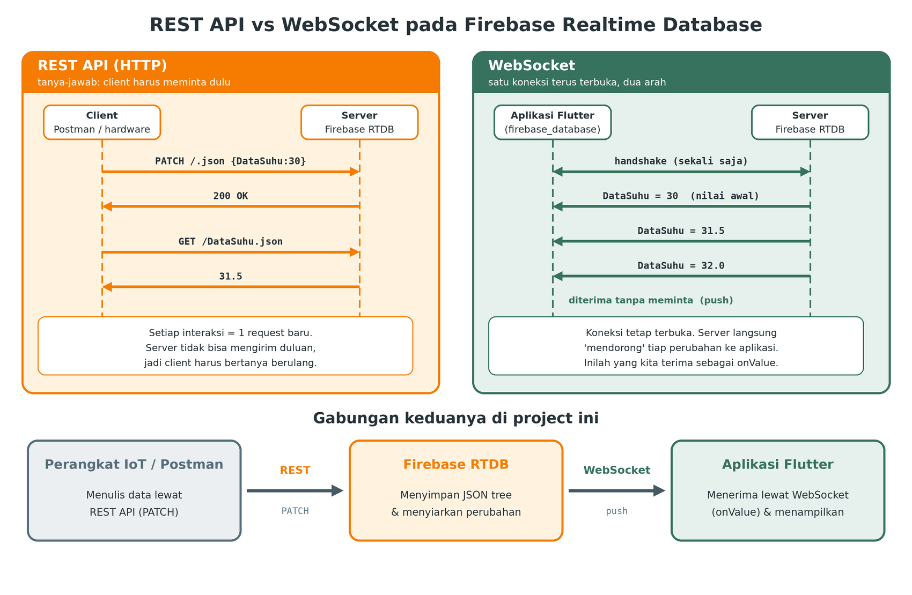
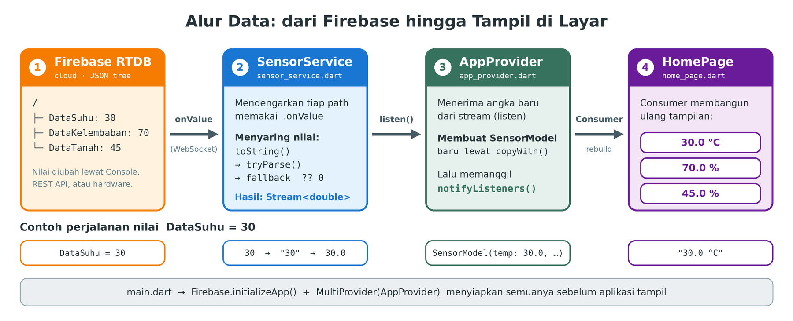
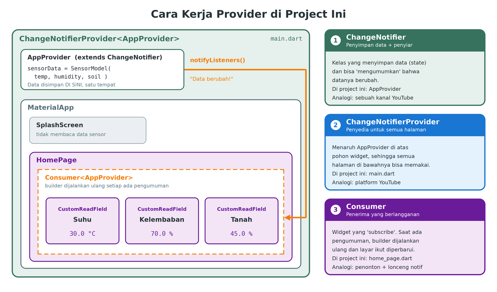
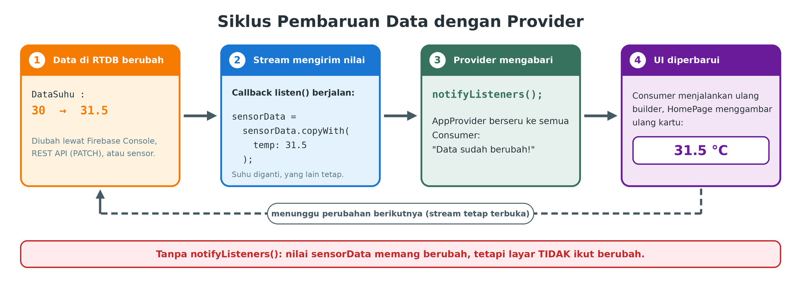
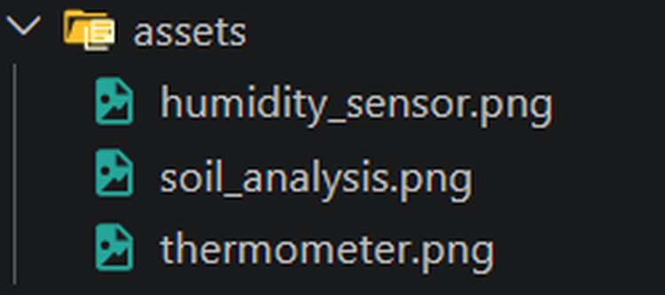

# FLUTTER + FIREBASE REALTIME-DATABASE

Aplikasi **Flutter** yang terintegrasi dengan **Firebase Realtime Database (RTDB)**.

## Daftar Isi

- [Dasar Teori](#dasar-teori)
  - [A. Firebase Realtime Database dan NoSQL JSON Tree](#a-firebase-realtime-database)
  - [B. JSON, `jsonEncode`, dan `jsonDecode`](#b-json)
  - [C. API dan REST API](#c-api-dan-rest-api)
  - [D. Firebase RTDB sebagai REST API](#d-firebase-rtdb-sebagai-rest-api)
  - [E. Firebase RTDB sebagai WebSocket](#e-firebase-rtdb-sebagai-websocket)
  - [F. Ringkasan Hubungan Antar Konsep](#f-ringkasan-hubungan-antar-konsep)
- [Prasyarat](#prasyarat)
- [1. Membuat Project Firebase](#1-membuat-project-firebase)
- [2. Membuat Realtime Database](#2-membuat-realtime-database)
- [3. Mengatur Security Rules](#3-mengatur-security-rules)
- [4. Membuat Struktur Data (Path)](#4-membuat-struktur-data-path)
- [5. Menghubungkan Flutter ke Firebase](#5-menghubungkan-flutter-ke-firebase)
- [6. Membaca Data Realtime di Flutter](#6-membaca-data-realtime-di-flutter)
  - [Alur Data](#alur-data)
  - [Memahami Provider (State Management)](#memahami-provider-state-management)
- Menjalankan Aplikasi di Web (Chrome/Edge) *(segera)*

---

## Dasar Teori

Sebelum membuat aplikasi, pahami dulu konsep-konsep yang dipakai di project ini. Bagian ini menjelaskan **apa itu Firebase Realtime Database**, **JSON**, **API dan REST API**, serta **WebSocket**, termasuk bagaimana semuanya saling berhubungan dalam sistem IoT.

### A. Firebase Realtime Database

#### Apa itu Firebase?

**Firebase** adalah platform dari Google yang menyediakan berbagai layanan *backend* siap pakai (database, autentikasi, hosting, notifikasi, dan lainnya). Developer tidak perlu membangun dan merawat server sendiri.

#### Apa itu Realtime Database?

**Firebase Realtime Database (RTDB)** adalah database berbasis **cloud** yang menyimpan data dan **menyinkronkannya secara realtime** ke semua perangkat yang sedang terhubung. Begitu satu nilai berubah, semua aplikasi yang "mendengarkan" nilai itu langsung menerima perubahannya tanpa perlu *refresh*.

| Fitur | Penjelasan |
|-------|------------|
| **Realtime** | Perubahan data langsung didorong (*push*) ke semua client yang berlangganan. |
| **Cloud** | Data tersimpan di server Google, bisa diakses dari mana saja lewat internet. |
| **Lintas platform** | Bisa diakses dari Flutter, Android, iOS, web, hingga mikrokontroler (lewat REST API). |
| **Offline support** | SDK menyimpan salinan data sementara, sehingga aplikasi tetap bisa menampilkan data terakhir saat koneksi terputus, lalu otomatis menyinkronkan lagi saat terhubung kembali. |
| **Security Rules** | Aturan untuk menentukan siapa yang boleh membaca dan menulis (lihat [Mengatur Security Rules](#3-mengatur-security-rules)). |

> Paket gratis (**Spark plan**) memiliki batas kuota penyimpanan dan transfer data. Kuota bisa berubah, jadi cek halaman *Pricing* Firebase untuk angka terbarunya.

#### SQL vs NoSQL

Database secara garis besar ada dua jenis:

| | **SQL (Relasional)** | **NoSQL** |
|--|----------------------|-----------|
| Bentuk data | **Tabel** berisi baris dan kolom | Fleksibel: dokumen, key-value, graf, atau pohon |
| Skema | Kaku, kolom harus didefinisikan dulu | Bebas, struktur bisa berubah kapan saja |
| Bahasa query | SQL (`SELECT`, `INSERT`, ...) | Tergantung produk (di RTDB: lewat *path*) |
| Contoh | MySQL, PostgreSQL, SQLite | Firebase RTDB, Firestore, MongoDB |

Contoh data sensor pada database **SQL**:

| id | suhu | kelembaban | tanah |
|----|------|------------|-------|
| 1 | 30 | 70 | 45 |

Data yang sama pada **NoSQL berbasis JSON tree** (RTDB):

```json
{
  "DataSuhu": 30,
  "DataKelembaban": 70,
  "DataTanah": 45
}
```

Tidak ada tabel, kolom, maupun perintah `CREATE TABLE`. Cukup tulis data pada sebuah alamat (*path*).

#### NoSQL berbasis JSON Tree

Seluruh isi Realtime Database adalah **satu pohon JSON yang besar**. Setiap bagian pohon punya nama khusus:

```
/                              ← root (akar): titik awal seluruh database
├── DataKelembaban : 0         ← node (cabang) dengan nilai 0 (leaf / daun)
├── DataSuhu       : 0
└── DataTanah      : 0
```

| Istilah | Arti | Contoh |
|---------|------|--------|
| **Root** | Akar pohon, semua data berada di bawahnya | `/` |
| **Node** | Satu titik pada pohon, punya nama (*key*) | `DataSuhu` |
| **Child** | Node yang berada di bawah node lain | `DataSuhu` adalah child dari root |
| **Leaf** | Node paling ujung yang berisi nilai | `0`, `30`, `"aktif"` |
| **Path** | Alamat menuju sebuah node | `/DataSuhu` |

Jika node punya anak lagi, strukturnya menjadi bertingkat:

```json
{
  "Perangkat1": {
    "DataSuhu": 30,
    "DataTanah": 45
  },
  "Perangkat2": {
    "DataSuhu": 28,
    "DataTanah": 50
  }
}
```

Path `/Perangkat1/DataSuhu` menunjuk ke nilai `30`.

**Hal yang perlu diketahui:**

- Tipe nilai yang didukung: string, angka, boolean, dan objek. Menulis `null` pada sebuah node berarti **menghapusnya**. Node kosong tidak disimpan.
- RTDB tidak punya tipe *array* asli. Array disimpan sebagai objek dengan key `0, 1, 2, ...`.
- Nama key tidak boleh mengandung karakter `.` `$` `#` `[` `]` `/`. Ada juga batas panjang key dan kedalaman pohon (cek dokumentasi resmi).
- Membaca sebuah path berarti ikut membaca **semua data di bawahnya**, jadi rancang struktur yang tidak terlalu dalam dan tidak terlalu besar.

**Kenapa cocok untuk proyek IoT?**

| Kelebihan | Kekurangan |
|-----------|------------|
| Sinkronisasi realtime bawaan, tanpa membuat server sendiri | Kemampuan query dan filter terbatas dibanding SQL |
| Struktur fleksibel, mudah menambah sensor baru | Data historis/log perlu didesain sendiri (misalnya dengan `POST`) |
| Bisa ditulis perangkat lewat REST API yang sederhana | Rules yang terlalu longgar berisiko keamanan |
| Gratis untuk skala belajar | Pembacaan path induk mengambil seluruh data di bawahnya |

---

### B. JSON

#### Apa itu JSON?

**JSON** (*JavaScript Object Notation*) adalah **format teks** untuk menyimpan dan mempertukarkan data dalam bentuk pasangan **key–value**. JSON mudah dibaca manusia, mudah diproses mesin, dan didukung hampir semua bahasa pemrograman (Dart, Python, C++/Arduino, JavaScript, dan lainnya).

```json
{
  "DataSuhu": 30.5,
  "DataKelembaban": 70,
  "perangkat": "ESP32-01",
  "aktif": true,
  "catatan": null
}
```

#### Format pertukaran data yang ada

JSON bukan satu-satunya format. Berikut perbandingannya:

| Format | Contoh | Ciri | Pemakaian umum |
|--------|--------|------|----------------|
| **JSON** | `{"suhu": 30}` | Ringan, hierarkis, mudah dibaca | REST API, aplikasi web/mobile, Firebase |
| **XML** | `<suhu>30</suhu>` | Berbasis tag, lebih panjang/verbose | Sistem lama, konfigurasi, SOAP |
| **CSV** | `suhu,tanah` ⏎ `30,45` | Tabel datar, sangat sederhana | Ekspor data, spreadsheet, data logging |
| **YAML** | `suhu: 30` | Sangat mudah dibaca manusia | File konfigurasi (misalnya `pubspec.yaml`) |
| **Protobuf / biner** | (bukan teks) | Sangat kecil dan cepat, tidak terbaca manusia | Komunikasi performa tinggi (gRPC) |

#### Format yang dipakai di project ini: JSON

Realtime Database menyimpan dan mengirim data dalam **JSON**. Alasan JSON dipakai:

1. **Format asli RTDB.** Seluruh database adalah pohon JSON, jadi tidak perlu konversi tambahan.
2. **Ringan.** Lebih singkat dari XML, cocok untuk perangkat IoT dan koneksi internet terbatas.
3. **Hierarkis.** Struktur bertingkat (objek di dalam objek) sesuai dengan bentuk pohon RTDB.
4. **Didukung luas.** Dart, ESP32/ESP8266 (library ArduinoJson), Python, dan Postman semuanya bisa membaca dan menulis JSON.
5. **Standar REST API.** Hampir semua REST API modern memakai JSON sebagai format utama.

#### Tipe data dalam JSON

| Tipe JSON | Contoh | Padanan di Dart |
|-----------|--------|-----------------|
| String | `"ESP32"` | `String` |
| Number | `30`, `70.5` | `int` atau `double` |
| Boolean | `true`, `false` | `bool` |
| Null | `null` | `null` |
| Object | `{"a": 1}` | `Map<String, dynamic>` |
| Array | `[1, 2, 3]` | `List<dynamic>` |

**Aturan penulisan JSON:**

- Key **wajib** diapit tanda kutip ganda: `"DataSuhu"`.
- String memakai tanda kutip ganda, **bukan** kutip tunggal.
- Tidak boleh ada koma di akhir elemen terakhir (*trailing comma*).
- Tidak ada komentar.

> Perhatikan perbedaan `30` (angka) dan `"30"` (string). Keduanya valid di JSON, tetapi tipenya berbeda. Inilah alasan `SensorService` perlu menyeragamkan nilai (dijelaskan di [Langkah 23](#langkah-23--sensor_servicedart)).

#### `jsonEncode` dan `jsonDecode`

Data di jaringan berbentuk **teks JSON**, sedangkan di dalam program Dart berbentuk **objek** (`Map`, `List`, dan sebagainya). Dua fungsi dari `dart:convert` menjembatani keduanya:

| Fungsi | Arah | Nama istilah | Keterangan |
|--------|------|--------------|------------|
| `jsonDecode(String)` | teks JSON → objek Dart | *Decode / parse / deserialisasi* | Dipakai saat **menerima** data |
| `jsonEncode(Object)` | objek Dart → teks JSON | *Encode / serialisasi* | Dipakai saat **mengirim** data |

```dart
import 'dart:convert';

void main() {
  // 1. jsonDecode: teks JSON -> objek Dart
  const raw = '{"DataSuhu": 30, "DataKelembaban": 70.5, "DataTanah": "45"}';
  final Map<String, dynamic> data = jsonDecode(raw);

  print(data['DataSuhu']);        // 30    (int)
  print(data['DataKelembaban']);  // 70.5  (double)
  print(data['DataTanah']);       // 45    (String, karena ada tanda kutip!)

  // 2. jsonEncode: objek Dart -> teks JSON
  final text = jsonEncode({'DataSuhu': 31.5, 'DataTanah': 40});
  print(text);                    // {"DataSuhu":31.5,"DataTanah":40}
}
```

Contoh di atas menunjukkan bahwa satu JSON bisa berisi **tipe yang bercampur** (`int`, `double`, `String`). Ini penting untuk dipahami pada bagian `SensorService`.

**Apakah project ini memakai `jsonEncode` / `jsonDecode`?**

Tidak secara langsung. Package `firebase_database` sudah melakukan *decode* JSON dari server dan *encode* data yang dikirim secara otomatis. Hasil decode-nya langsung tersedia di `event.snapshot.value`. Kamu baru perlu `jsonDecode` / `jsonEncode` jika mengakses RTDB lewat **REST API** memakai package `http` (tanpa SDK):

```dart
// Contoh (tidak dipakai di project ini)
final response = await http.get(Uri.parse('$baseUrl/DataSuhu.json'));
final suhu = jsonDecode(response.body);   // teks "30" -> angka 30
```

---

### C. API dan REST API

#### Apa itu API?

**API** (*Application Programming Interface*) adalah **perantara** yang mengatur bagaimana satu program meminta layanan atau data dari program lain, tanpa perlu tahu cara kerja di dalamnya.

> **Analogi restoran:** kamu (aplikasi) memesan lewat **pelayan** (API) kepada **dapur** (server/database). Kamu tidak masuk ke dapur, cukup mengikuti menu dan aturan pemesanan.

#### Apa itu REST API?

**REST** (*Representational State Transfer*) adalah gaya perancangan API yang memakai protokol **HTTP**, dengan prinsip:

| Prinsip | Penjelasan | Contoh |
|---------|------------|--------|
| **Resource punya alamat (URL)** | Setiap data punya alamat sendiri | `.../DataSuhu.json` |
| **Method HTTP menyatakan aksi** | Jenis permintaan menentukan operasinya | `GET`, `PUT`, `PATCH`, `POST`, `DELETE` |
| **Stateless** | Setiap permintaan berdiri sendiri, server tidak mengingat permintaan sebelumnya | Tiap `PATCH` membawa semua info yang dibutuhkan |
| **Representasi data** | Data dikirim dalam format tertentu, umumnya JSON | `{"DataSuhu": 30}` |
| **Kode status** | Server menjawab dengan kode angka | `200` berhasil, `401` ditolak, `404` tidak ditemukan |

**Method HTTP dan padanannya (CRUD):**

| Method | Aksi | Arti |
|--------|------|------|
| `GET` | Read | Membaca data |
| `POST` | Create | Menambah data baru |
| `PUT` | Create/Update | Menulis dan **menimpa seluruhnya** |
| `PATCH` | Update | Mengubah **sebagian** data saja |
| `DELETE` | Delete | Menghapus data |

#### Hubungan API dan REST API di project ini

**API** adalah konsep umum (pintu komunikasi), sedangkan **REST API** adalah salah satu bentuknya. Firebase RTDB menyediakan **dua pintu** ke data yang sama:

| Pintu | Bentuk API | Dipakai oleh | Cara kerja |
|-------|------------|--------------|------------|
| **SDK** (`firebase_database`) | API berupa library Dart | **Aplikasi Flutter** | Koneksi persisten (WebSocket) |
| **REST API** | API berbasis HTTP + JSON | **Hardware (ESP32), Postman**, atau program apa pun | Permintaan HTTP biasa |

Keduanya mengakses **database yang sama**, sehingga data yang ditulis lewat REST API akan langsung terlihat di aplikasi Flutter.

---

### D. Firebase RTDB sebagai REST API

Setiap *path* di Realtime Database bisa diakses seperti sebuah **endpoint REST API** dengan cara menambahkan **`.json`** di akhir URL database.

```
https://fir-realtimedatabase-7a054-default-rtdb.asia-southeast1.firebasedatabase.app/DataSuhu.json
└────────────────────────── URL database ──────────────────────────────┘└── path ──┘└ wajib ┘
```

> Ganti URL di atas dengan **URL database milikmu** (lihat tab **Data** di Firebase Console). Tanpa akhiran `.json`, permintaan tidak akan dikenali sebagai REST API.

#### Wujud REST API dari project ini

Dengan struktur data `DataSuhu`, `DataKelembaban`, dan `DataTanah`, endpoint-nya adalah:

| Resource | Endpoint | Isi |
|----------|----------|-----|
| Seluruh database | `<URL_DATABASE>/.json` | `{"DataKelembaban":0,"DataSuhu":0,"DataTanah":0}` |
| Suhu | `<URL_DATABASE>/DataSuhu.json` | `0` |
| Kelembaban udara | `<URL_DATABASE>/DataKelembaban.json` | `0` |
| Kelembaban tanah | `<URL_DATABASE>/DataTanah.json` | `0` |

Operasi yang bisa dilakukan:

| Tujuan | Method | Endpoint | Body | Respons |
|--------|--------|----------|------|---------|
| Baca seluruh data | `GET` | `/.json` | - | Seluruh pohon JSON |
| Baca suhu | `GET` | `/DataSuhu.json` | - | `30` |
| Ganti nilai suhu | `PUT` | `/DataSuhu.json` | `30` | `30` |
| **Ubah beberapa nilai sekaligus** | **`PATCH`** | `/.json` | `{"DataSuhu":30,"DataTanah":45}` | Data yang ditulis |
| Tambah data dengan ID otomatis | `POST` | `/Riwayat.json` | `{"suhu":30}` | `{"name":"-Nabc..."}` |
| Hapus data | `DELETE` | `/DataSuhu.json` | - | `null` |

#### `PUT` vs `PATCH`: jangan sampai tertukar

Kondisi awal database: `DataSuhu = 0`, `DataKelembaban = 0`, `DataTanah = 0`.

| Perintah | Body | Hasil akhir database |
|----------|------|----------------------|
| `PUT /.json` | `{"DataSuhu": 30}` | ⚠️ Hanya `DataSuhu: 30`. **Dua path lain terhapus**, karena PUT menimpa seluruh isi. |
| `PATCH /.json` | `{"DataSuhu": 30}` | ✅ `DataSuhu: 30`, sedangkan `DataKelembaban` dan `DataTanah` **tetap ada**. |

Untuk mengirim data sensor, gunakan **`PATCH`** pada root (`/.json`) agar beberapa nilai terbarui sekaligus tanpa menghapus yang lain.

> Jika sebuah path terhapus (misalnya lewat `DELETE`), aplikasi tidak error. Nilainya terbaca `null` dan `SensorService` mengubahnya menjadi `0` lewat nilai cadangan (*fallback*).

#### Cara mencoba REST API

**1. Browser (hanya `GET`)**: tempel URL `.../DataSuhu.json` ke address bar dan nilainya akan tampil.

**2. Thunder Client / Postman**

1. Buat *New Request*.
2. Pilih method **PATCH**, isi URL: `<URL_DATABASE>/.json`.
3. Buka tab **Body → JSON**, isi:
   ```json
   {
     "DataSuhu": 30,
     "DataKelembaban": 70.5,
     "DataTanah": 45
   }
   ```
4. Klik **Send**. Status **200 OK** berarti berhasil.

**3. PowerShell (Windows)**

```powershell
$base = "https://fir-realtimedatabase-7a054-default-rtdb.asia-southeast1.firebasedatabase.app"

# GET: membaca suhu
Invoke-RestMethod -Uri "$base/DataSuhu.json" -Method Get

# PATCH: mengubah beberapa nilai sekaligus
$body = '{"DataSuhu": 30, "DataKelembaban": 70.5, "DataTanah": 45}'
Invoke-RestMethod -Uri "$base/.json" -Method Patch -Body $body -ContentType "application/json"
```

**4. curl (macOS / Linux / Git Bash)**

```bash
BASE="https://fir-realtimedatabase-7a054-default-rtdb.asia-southeast1.firebasedatabase.app"

curl -X PATCH -d '{"DataSuhu": 30, "DataKelembaban": 70.5}' "$BASE/.json"
```

> **Syarat:** Security Rules harus mengizinkan akses (`.read` dan `.write` bernilai `true`, seperti di Langkah 8). Jika tidak, server membalas **`401 Permission denied`**. Pada proyek sungguhan, akses diamankan dengan autentikasi dan permintaan REST menyertakan token (`?auth=<token>`).

> Pada proyek akhir, perangkat seperti ESP32 mengirim data sensor dengan prinsip yang sama persis: **HTTP `PATCH` ke `/.json` berisi JSON**. Implementasi hardware tidak dibahas di dokumentasi ini.

---

### E. Firebase RTDB sebagai WebSocket

#### Masalah pada HTTP biasa

Pada REST API (HTTP), komunikasi bersifat **tanya-jawab**: client bertanya, server menjawab, lalu koneksi selesai. Server **tidak bisa mengirim data lebih dulu**. Agar aplikasi tahu ada data baru, ia harus bertanya berulang-ulang (*polling*, misalnya tiap 1 detik). Ini boros dan datanya tetap terlambat.

#### Solusi: WebSocket

**WebSocket** adalah protokol komunikasi **dua arah** dengan **satu koneksi yang tetap terbuka**. Setelah terhubung (*handshake*), server dapat **mendorong (*push*) data kapan saja** tanpa diminta.

| | **REST API (HTTP)** | **WebSocket** |
|--|---------------------|---------------|
| Pola komunikasi | Tanya-jawab (client memulai) | Dua arah, server bisa mengirim duluan |
| Koneksi | Dibuka dan ditutup per permintaan | **Satu koneksi terus terbuka** |
| Data baru | Harus ditanya berulang (*polling*) | Langsung dikirim saat berubah |
| Awalan URL | `http://` / `https://` | `ws://` / `wss://` (aman) |
| Cocok untuk | Menulis/membaca sesekali, perangkat sederhana | Tampilan realtime |



#### Bagaimana RTDB memakai WebSocket

SDK Firebase (`firebase_database`) umumnya membuka **satu koneksi WebSocket yang persisten** ke server RTDB (dengan cadangan *long polling* jika WebSocket tidak tersedia). Ketika kode memasang `.onValue`:

1. Aplikasi "berlangganan" ke sebuah path lewat koneksi tersebut.
2. Server langsung mengirim **nilai saat ini**.
3. Setiap kali nilai di path itu berubah (dari mana pun: Console, REST API, atau hardware), server **mendorong** nilai terbaru ke semua aplikasi yang berlangganan.
4. Jika koneksi terputus, SDK mencoba tersambung lagi secara otomatis.

Inilah mesin di balik `Stream` pada [`SensorService`](#langkah-23--sensor_servicedart). Kamu tidak menulis kode WebSocket sendiri, cukup memakai `.onValue`.

> REST API RTDB sebenarnya juga bisa *streaming* memakai teknik *Server-Sent Events* (header `Accept: text/event-stream`). Namun di project ini aplikasi Flutter memakai SDK, sehingga kita tidak memakainya.

#### Gabungan di project ini

| Tahap | Pelaku | Teknologi | Peran |
|-------|--------|-----------|-------|
| 1 | Hardware / Postman | **REST API** (`PATCH`) | **Menulis** data ke database |
| 2 | Firebase RTDB | JSON tree | **Menyimpan** data dan mengetahui ada perubahan |
| 3 | Aplikasi Flutter | **WebSocket** (`onValue`) | **Menerima** perubahan secara realtime |

Itulah sebabnya saat kamu mengirim `PATCH` lewat Postman, angka di aplikasi Flutter berubah seketika tanpa *refresh*.

### F. Ringkasan Hubungan Antar Konsep

| Konsep | Peran di project ini |
|--------|----------------------|
| **Firebase RTDB** | Penyimpan data sensor di cloud |
| **NoSQL / JSON tree** | Bentuk penyimpanan: pohon dengan path `DataSuhu`, `DataKelembaban`, `DataTanah` |
| **JSON** | Format data yang disimpan dan dikirim |
| **`jsonEncode` / `jsonDecode`** | Penerjemah JSON ↔ objek Dart (dilakukan otomatis oleh SDK) |
| **API** | Pintu akses ke data (SDK dan REST) |
| **REST API** | Jalur **menulis** dari hardware/Postman (`PATCH`, `GET`, dll.) |
| **WebSocket** | Jalur **menerima** data realtime di aplikasi (`onValue`) |

---

## Prasyarat

- Akun Google
- Flutter SDK terpasang (`flutter doctor` tanpa error)
- Editor (VS Code / Android Studio)
- Koneksi internet

---

## 1. Membuat Project Firebase

### Langkah 1 — Buka Firebase Console

1. Buka [https://firebase.google.com](https://firebase.google.com).
2. Login dengan akun Google, lalu klik **Buka konsol** (pojok kanan atas).


> Banner "Get $300 to unlock all Firebase features" **tidak perlu diklik**. Praktik ini cukup memakai paket gratis **Spark plan**.

### Langkah 2 — Buat Project Baru

Di halaman konsol, klik **Create a new Firebase project**.


### Langkah 3 — Beri Nama Project

1. Isi **Project name**, pada contoh ini: `firebaserealtimedatabase`.
2. Firebase otomatis membuat **Project ID** unik (contoh: `fir-realtimedatabase-7a054`). ID ini bisa berbeda di akun masing-masing.
3. Klik **Continue**, lalu ikuti langkah berikutnya sampai project selesai dibuat. Opsi tambahan seperti Gemini atau Google Analytics tidak wajib untuk praktik ini.


Setelah selesai, kamu akan masuk ke halaman **Project Overview** dengan label **Spark plan** (gratis, $0/bulan).

---

## 2. Membuat Realtime Database

### Langkah 4 — Buka Menu Realtime Database

Di sidebar kiri, pilih **Databases and storage** lalu klik **Realtime Database** (di bagian *NoSQL*).

> Jangan tertukar dengan **Firestore**. Keduanya sama-sama NoSQL, tetapi contoh ini memakai **Realtime Database**.


### Langkah 5 — Create Database

Klik tombol **Create Database**.


### Langkah 6 — Pilih Lokasi Database

Pada langkah **Database options**, pilih lokasi server. Untuk pengguna di Indonesia, pilih **Singapore (asia-southeast1)** karena paling dekat sehingga latensinya lebih rendah. Lalu klik **Next**.


---

## 3. Mengatur Security Rules

### Langkah 7 — Pilih Mode Awal

Pada langkah **Security rules**, ada dua pilihan:

| Mode | Keterangan |
|------|------------|
| **Locked mode** | Semua akses dari client ditolak (`.read` dan `.write` bernilai `false`). Paling aman, tetapi aplikasi belum bisa membaca/menulis. |
| **Test mode** | Akses terbuka sementara. Aturan harus diperbarui dalam 30 hari. |

Pada contoh ini pilih **Start in locked mode**, lalu klik **Enable**. Rules akan diubah manual pada langkah berikutnya.


### Langkah 8 — Ubah Rules agar Bisa Dibaca/Ditulis (untuk Praktik)

1. Buka tab **Rules**.
2. Ubah isinya menjadi:

```json
{
  "rules": {
    ".read": true,
    ".write": true
  }
}
```

3. Klik **Publish** agar perubahan berlaku.


> ⚠️ **Peringatan keamanan**
> Rules di atas membuat database **terbuka untuk siapa saja** yang memiliki URL-nya. Gunakan hanya untuk **belajar dan pengujian**. Untuk proyek akhir yang sesungguhnya, tambahkan **Firebase Authentication** dan batasi akses, misalnya:
>
> ```json
> {
>   "rules": {
>     ".read": "auth != null",
>     ".write": "auth != null"
>   }
> }
> ```

---

## 4. Membuat Struktur Data (Path)

### Langkah 9 — Tambah Data Manual

1. Buka tab **Data**.
2. Klik ikon **+** di samping URL database.
3. Isi **Key** dan **Value**, lalu klik **Add**.
4. Ulangi untuk setiap path yang dibutuhkan.

Catatan: **URL database** (contoh: `https://fir-realtimedatabase-7a054-default-rtdb.asia-southeast1.firebasedatabase.app`) akan dipakai pada aplikasi Flutter, jadi salin dan simpan.


### Langkah 10 — Hasil Struktur Data

Buat tiga path berikut dengan nilai awal `0`:

| Key | Value | Contoh Kegunaan |
|-----|-------|-----------------|
| `DataSuhu` | `0` | Suhu dari sensor |
| `DataKelembaban` | `0` | Kelembaban udara |
| `DataTanah` | `0` | Kelembaban tanah |

Struktur JSON-nya:

```json
{
  "DataSuhu": 0,
  "DataKelembaban": 0,
  "DataTanah": 0
}
```


**Cara menguji:** klik value pada salah satu path (misalnya `DataSuhu`), ubah angkanya (misalnya menjadi `30`), lalu tekan Enter. Nilai ini nantinya akan langsung berubah di aplikasi Flutter tanpa perlu refresh.

---

## 5. Menghubungkan Flutter ke Firebase

Pada bagian ini project Flutter dihubungkan ke project Firebase yang sudah dibuat, menggunakan **Firebase CLI** dan **FlutterFire CLI**. Semua perintah diketik di **terminal VS Code** (`Ctrl + `` ` ``), kecuali Langkah 11 yang bisa memakai Command Prompt (CMD).

> ⚠️ **Penting:** pastikan **Realtime Database sudah dibuat** (Bagian 2–4) *sebelum* menjalankan `flutterfire configure`. Jika belum, `databaseURL` tidak akan ikut tertulis di file konfigurasi dan harus mengulang proses ini.

### Langkah 11 — Cek Node.js

Firebase CLI membutuhkan **Node.js**. Buka **Command Prompt** (tekan `Win + R`, ketik `cmd`, Enter), lalu jalankan:

```bash
node -v
```


- Jika muncul nomor versi (contoh: `v22.21.0`), Node.js sudah terpasang. Lanjut ke Langkah 12.
- Jika muncul pesan `'node' is not recognized as an internal or external command`, Node.js belum terpasang:
  1. Download versi **LTS** di [https://nodejs.org/en/download](https://nodejs.org/en/download).
  2. Jalankan installer dan ikuti langkahnya sampai selesai (biarkan opsi bawaan).
  3. **Tutup lalu buka kembali** CMD/VS Code, kemudian ulangi `node -v`.

### Langkah 12 — Install Firebase CLI

Di terminal project VS Code, jalankan:

```bash
npm install -g firebase-tools
```


Tunggu sampai muncul pesan `changed ... packages`. Peringatan `npm warn deprecated` boleh diabaikan.

### Langkah 13 — Login ke Firebase

Jalankan:

```bash
firebase login
```

Terminal akan menanyakan dua hal (boleh dijawab **No**), lalu membuka browser untuk login.


> Jika browser tidak terbuka otomatis, salin URL yang muncul di terminal lalu buka manual di browser.

Di browser:

1. **Pilih akun** Google, gunakan akun yang **sama** dengan yang dipakai membuat project Firebase.

   

2. Klik **Lanjutkan**.

   

3. Klik **Izinkan** agar Firebase CLI boleh mengakses akun.

   

4. Jika muncul tulisan **Firebase CLI Login Successful**, login berhasil. Tab browser boleh ditutup dan kembali ke VS Code.

   

### Langkah 14 — Install FlutterFire CLI

Jalankan:

```bash
dart pub global activate flutterfire_cli
```

> Jika nanti muncul error `flutterfire is not recognized`, tambahkan folder `C:\Users\<nama-user>\AppData\Local\Pub\Cache\bin` ke **Environment Variables → Path**, lalu buka ulang VS Code.

### Langkah 15 — Jalankan `flutterfire configure`

Pastikan posisi terminal berada di **root project Flutter** (satu folder dengan `pubspec.yaml`), lalu jalankan:

```bash
flutterfire configure
```

1. Jika muncul pertanyaan *"You have an existing `firebase.json` file ... reuse the values?"*, pilih **no**. Pertanyaan ini hanya muncul bila project sebelumnya sudah pernah dikonfigurasi.
2. Pilih project Firebase yang tadi dibuat (pada contoh ini: `fir-realtimedatabase-7a054`) dengan **panah atas/bawah**, lalu tekan **Enter**.


### Langkah 16 — Pilih Platform

Pada pertanyaan *"Which platforms should your configuration support?"*, pilih **web** saja karena aplikasi contoh ini dijalankan di **Chrome/Edge**:

- Gerakkan kursor dengan **panah atas/bawah**.
- Tekan **Spasi** pada `web` sampai muncul tanda centang ✓.
- Tekan **Enter** untuk melanjutkan.


> Ingin menjalankan di Android atau platform lain? Ulangi `flutterfire configure` dan centang platform tersebut.

### Langkah 17 — Tambahkan Package `firebase_core`

File yang dihasilkan memakai package `firebase_core`, jadi pastikan sudah terpasang:

```bash
flutter pub add firebase_core
```

### Langkah 18 — Hasil: `firebase_options.dart`

Setelah proses selesai, akan muncul file baru **`firebase_options.dart`** di folder `lib/`.


Isi file (nilai `apiKey`, `appId`, dan `messagingSenderId` pada contoh ini disamarkan, milik kamu akan berbeda):

```dart
// File generated by FlutterFire CLI.
// ignore_for_file: type=lint
import 'package:firebase_core/firebase_core.dart' show FirebaseOptions;
import 'package:flutter/foundation.dart'
    show defaultTargetPlatform, kIsWeb, TargetPlatform;

/// Default [FirebaseOptions] for use with your Firebase apps.
///
/// Example:
/// ```dart
/// import 'firebase_options.dart';
/// // ...
/// await Firebase.initializeApp(
///   options: DefaultFirebaseOptions.currentPlatform,
/// );
/// ```
class DefaultFirebaseOptions {
  static FirebaseOptions get currentPlatform {
    if (kIsWeb) {
      return web;
    }
    switch (defaultTargetPlatform) {
      case TargetPlatform.android:
        throw UnsupportedError(
          'DefaultFirebaseOptions have not been configured for android - '
          'you can reconfigure this by running the FlutterFire CLI again.',
        );
      case TargetPlatform.iOS:
        throw UnsupportedError(
          'DefaultFirebaseOptions have not been configured for ios - '
          'you can reconfigure this by running the FlutterFire CLI again.',
        );
      case TargetPlatform.macOS:
        throw UnsupportedError(
          'DefaultFirebaseOptions have not been configured for macos - '
          'you can reconfigure this by running the FlutterFire CLI again.',
        );
      case TargetPlatform.windows:
        throw UnsupportedError(
          'DefaultFirebaseOptions have not been configured for windows - '
          'you can reconfigure this by running the FlutterFire CLI again.',
        );
      case TargetPlatform.linux:
        throw UnsupportedError(
          'DefaultFirebaseOptions have not been configured for linux - '
          'you can reconfigure this by running the FlutterFire CLI again.',
        );
      default:
        throw UnsupportedError(
          'DefaultFirebaseOptions are not supported for this platform.',
        );
    }
  }

  static const FirebaseOptions web = FirebaseOptions(
    apiKey: 'YOUR_API_KEY',
    appId: 'YOUR_APP_ID',
    messagingSenderId: 'YOUR_MESSAGING_SENDER_ID',
    projectId: 'fir-realtimedatabase-7a054',
    authDomain: 'fir-realtimedatabase-7a054.firebaseapp.com',
    databaseURL: 'https://fir-realtimedatabase-7a054-default-rtdb.asia-southeast1.firebasedatabase.app',
    storageBucket: 'fir-realtimedatabase-7a054.firebasestorage.app',
  );
}
```

### Penjelasan Kode `firebase_options.dart`

> File ini **dibuat otomatis** oleh FlutterFire CLI. Jangan diedit manual. Jika ada yang salah atau ingin menambah platform, jalankan ulang `flutterfire configure`.

#### 1. Komentar dan import (baris atas)

```dart
// ignore_for_file: type=lint
import 'package:firebase_core/firebase_core.dart' show FirebaseOptions;
import 'package:flutter/foundation.dart'
    show defaultTargetPlatform, kIsWeb, TargetPlatform;
```

| Baris | Fungsi |
|-------|--------|
| `// ignore_for_file: type=lint` | Mematikan peringatan *lint* (gaya penulisan) di file ini karena kodenya dibuat mesin. |
| `FirebaseOptions` | Kelas dari `firebase_core` yang menyimpan semua data identitas project Firebase. |
| `kIsWeb` | Bernilai `true` jika aplikasi berjalan di browser. |
| `defaultTargetPlatform` | Memberi tahu platform tempat aplikasi berjalan (Android, iOS, Windows, dan seterusnya). |
| `TargetPlatform` | Daftar nama platform yang dipakai untuk pencocokan di `switch`. |

#### 2. Kelas `DefaultFirebaseOptions`

```dart
class DefaultFirebaseOptions {
  static FirebaseOptions get currentPlatform { ... }
}
```

Kelas ini adalah "pintu masuk" konfigurasi. Bagian yang dipanggil dari `main.dart` adalah **`currentPlatform`**, yang otomatis memilih konfigurasi sesuai platform tempat aplikasi berjalan.

#### 3. Logika pemilihan platform

```dart
if (kIsWeb) {
  return web;
}
switch (defaultTargetPlatform) {
  case TargetPlatform.android:
    throw UnsupportedError(...);
  ...
}
```

- Jika aplikasi berjalan di **web** (`kIsWeb == true`), maka mengembalikan konfigurasi `web`.
- Jika berjalan di platform lain, kode masuk ke `switch`. Karena pada Langkah 16 hanya **web** yang dipilih, platform lain (Android, iOS, macOS, Windows, Linux) akan **melempar `UnsupportedError`** berisi pesan bahwa platform itu belum dikonfigurasi.
- Itu sebabnya aplikasi ini hanya bisa dijalankan di Chrome/Edge. Jika dijalankan di Android, akan muncul error tersebut.

#### 4. Konfigurasi `web`

```dart
static const FirebaseOptions web = FirebaseOptions(
  apiKey: '...',
  appId: '...',
  messagingSenderId: '...',
  projectId: '...',
  authDomain: '...',
  databaseURL: '...',
  storageBucket: '...',
);
```

| Properti | Penjelasan |
|----------|------------|
| `apiKey` | Kunci API untuk mengidentifikasi aplikasi web kamu ke layanan Firebase. |
| `appId` | ID unik aplikasi web yang terdaftar di project Firebase. |
| `messagingSenderId` | ID pengirim untuk Firebase Cloud Messaging (notifikasi). Tidak dipakai di praktik ini, tapi tetap dibuat otomatis. |
| `projectId` | ID unik project Firebase (sama dengan yang tampil saat membuat project). |
| `authDomain` | Domain untuk Firebase Authentication. Belum dipakai selama belum memakai fitur login. |
| `databaseURL` | **Alamat Realtime Database.** Properti inilah yang paling penting di praktik ini, karena aplikasi memakainya untuk membaca/menulis data ke RTDB. |
| `storageBucket` | Lokasi penyimpanan file (Cloud Storage). Tidak dipakai di praktik ini. |

> Untuk praktik ini yang benar-benar dipakai adalah `projectId` dan **`databaseURL`**. Properti lain terisi otomatis dan boleh dibiarkan.

#### 5. Cara file ini dipakai

Nanti di `main.dart`, Firebase diinisialisasi dengan memanggil:

```dart
await Firebase.initializeApp(
  options: DefaultFirebaseOptions.currentPlatform,
);
```

Kode lengkapnya dibahas pada bagian [Membaca Data Realtime di Flutter](#6-membaca-data-realtime-di-flutter).

> ⚠️ **Catatan keamanan**
> `apiKey` pada Firebase Web bukan password, melainkan pengenal project, jadi aman berada di aplikasi. Namun, selama **Security Rules** masih `true` (Langkah 8), siapa pun yang tahu `databaseURL` bisa membaca dan menulis data. Gunakan hanya untuk belajar, dan batasi rules untuk proyek sungguhan.

---

### Troubleshooting Bagian Ini

| Masalah | Penyebab | Solusi |
|---------|----------|--------|
| `'node' is not recognized` | Node.js belum terpasang atau terminal belum di-restart | Install dari [nodejs.org](https://nodejs.org/en/download), lalu buka ulang terminal |
| `npm`/`firebase` ... *running scripts is disabled on this system* | Kebijakan PowerShell memblokir script | Jalankan `Set-ExecutionPolicy -Scope CurrentUser RemoteSigned`, lalu coba lagi |
| `firebase is not recognized` | Folder npm global belum masuk PATH | Tutup dan buka ulang VS Code. Jika masih gagal, cek `npm config get prefix` dan tambahkan ke PATH |
| `flutterfire is not recognized` | Folder Pub Cache belum masuk PATH | Tambahkan `%LOCALAPPDATA%\Pub\Cache\bin` ke PATH |
| Project tidak muncul saat `flutterfire configure` | Login dengan akun Google yang berbeda | Jalankan `firebase logout`, lalu `firebase login` dengan akun yang benar |
| `databaseURL` tidak ada di `firebase_options.dart` | Realtime Database belum dibuat saat configure | Buat RTDB dulu, lalu jalankan ulang `flutterfire configure` |

---

## 6. Membaca Data Realtime di Flutter

Pada bagian ini aplikasi dibangun untuk **menampilkan data suhu, kelembaban udara, dan kelembaban tanah** dari Firebase Realtime Database secara **realtime**. Saat nilai di RTDB berubah (lewat Firebase Console atau REST API), tampilan aplikasi ikut berubah tanpa refresh.

### Alur Data

Sebelum menulis kode, pahami dulu **perjalanan satu nilai** dari Firebase sampai muncul di layar:



| No | Tahap | File | Yang terjadi |
|----|-------|------|--------------|
| 1 | **Firebase RTDB** | (cloud) | Nilai tersimpan di pohon JSON (`DataSuhu: 30`). Saat nilai berubah, server mendorongnya lewat koneksi WebSocket. |
| 2 | **SensorService** | `sensor_service.dart` | Mendengarkan path dengan `onValue`, lalu **menyaring** nilai mentah menjadi `double` yang aman (`30` → `30.0`). Hasilnya berupa `Stream<double>`. |
| 3 | **AppProvider** | `app_provider.dart` | Menerima angka dari stream, membuat `SensorModel` baru lewat `copyWith()`, lalu memanggil `notifyListeners()`. |
| 4 | **HomePage** | `home_page.dart` | `Consumer` mendengar pengumuman, lalu membangun ulang tampilan: tiga `CustomReadField` menampilkan `30.0 °C`, `70.0 %`, dan `45.0 %`. |

Di bawahnya, **`main.dart`** menyiapkan semuanya sebelum aplikasi tampil: menginisialisasi Firebase dan mendaftarkan `AppProvider`.

### Memahami Provider (State Management)

Project ini memakai package **`provider`** untuk *state management*. Bagian ini menjelaskan konsepnya secara bertahap sebelum masuk ke kode.

#### Apa itu *state*?

**State** adalah **data yang bisa berubah dan memengaruhi tampilan**. Pada project ini, state-nya adalah **nilai suhu, kelembaban udara, dan kelembaban tanah** (`sensorData`). Setiap nilai itu berubah, tampilan harus ikut berubah.

Flutter bersifat *deklaratif*: tampilan adalah **hasil dari state**. Kamu tidak memerintah "ubah teks ini menjadi 31.5", tetapi mengubah state, lalu Flutter **menggambar ulang** tampilannya.

#### Apa itu *state management*?

**State management** adalah cara **mengatur di mana state disimpan, siapa yang boleh mengubahnya, dan bagaimana tampilan tahu kapan harus diperbarui**.

**Kenapa tidak cukup `setState()`?**

| | Tanpa state management (`StatefulWidget` + `setState`) | Dengan Provider |
|--|--------------------------------------------------------|-----------------|
| Tempat data | Terkunci di dalam satu widget/halaman | Disimpan di **satu tempat terpusat** (`AppProvider`) |
| Berbagi data antarhalaman | Harus dioper lewat constructor dari satu widget ke widget lain (*prop drilling*) | Halaman mana pun cukup "mengambil" dari provider |
| Berlangganan ke Firebase | Dimulai ulang tiap halaman dibuka | Dimulai **sekali** saat aplikasi mulai |
| Isi kode halaman | Bercampur antara UI dan logika data | **Terpisah**: UI hanya menampilkan, logika ada di provider |
| Kemudahan perawatan | Makin banyak halaman makin rumit | Rapi dan mudah dikembangkan |

#### Tiga komponen utama Provider



| Komponen | Tugas | Di project ini | Analogi |
|----------|-------|----------------|---------|
| **`ChangeNotifier`** | Kelas yang **menyimpan data** dan bisa **mengumumkan** bahwa datanya berubah (`notifyListeners()`) | `AppProvider` | Sebuah **kanal YouTube** yang bisa mengirim notifikasi |
| **`ChangeNotifierProvider`** | **Menaruh** `ChangeNotifier` di atas pohon widget agar bisa diakses semua widget di bawahnya, sekaligus membuat dan membuangnya | `main.dart` | **Platform YouTube** yang menyediakan kanal ke semua penonton |
| **`Consumer`** | Widget yang **berlangganan**: setiap ada pengumuman, `builder`-nya dijalankan ulang sehingga tampilan diperbarui | `home_page.dart` | **Penonton** yang subscribe dan menyalakan lonceng notifikasi |

Perhatikan pada gambar: `ChangeNotifierProvider` berada **di atas `MaterialApp`**, sehingga semua halaman di dalamnya (`SplashScreen`, `HomePage`, dan halaman yang dibuka lewat `Navigator.push`) bisa mengakses `AppProvider`.

#### Siklus pembaruan data



1. Nilai di RTDB berubah (misalnya `DataSuhu` dari `30` menjadi `31.5`).
2. Stream mengirim nilai baru, lalu callback `listen()` di `AppProvider` membuat `SensorModel` baru lewat `copyWith()`.
3. `notifyListeners()` **mengumumkan** ke semua `Consumer` bahwa data sudah berubah.
4. `Consumer` menjalankan ulang `builder`-nya, dan layar menampilkan `31.5 °C`.

Setelah itu stream tetap terbuka dan menunggu perubahan berikutnya, sehingga siklus ini terus berulang selama aplikasi berjalan.

> ⚠️ **`notifyListeners()` wajib dipanggil.** Mengubah `sensorData` saja tidak membuat layar berubah. `notifyListeners()` adalah "lonceng" yang memberi tahu Flutter untuk menggambar ulang.

#### Tiga cara membaca provider di widget

| Cara | Perilaku | Dipakai saat |
|------|----------|--------------|
| `Consumer<AppProvider>` | `builder` dijalankan ulang tiap ada notifikasi, hanya bagian di dalam `builder` yang dibangun ulang | Menampilkan data yang berubah (**dipakai di project ini**) |
| `context.watch<AppProvider>()` | Seluruh `build()` dijalankan ulang tiap ada notifikasi | Versi singkat dari `Consumer` |
| `context.read<AppProvider>()` | Membaca sekali, **tidak** berlangganan perubahan | Dipanggil dari tombol atau aksi (misalnya mengirim perintah) |

### Langkah 19 — Tambahkan Package

Jalankan perintah berikut di terminal VS Code (root project):

```bash
flutter pub add firebase_database
flutter pub add provider
flutter pub add google_fonts
```

> `firebase_core` sudah ditambahkan pada Langkah 17.

Setelah berhasil, bagian `dependencies` di `pubspec.yaml` akan berisi package tersebut (nomor versi bisa berbeda pada tiap waktu):


#### Fungsi masing-masing package

| Package | Fungsi di proyek ini |
|---------|----------------------|
| `firebase_core` | Package dasar Firebase. Wajib dipanggil lebih dulu (`Firebase.initializeApp`) sebelum layanan Firebase lain dipakai. |
| `firebase_database` | Library untuk **Realtime Database**. Dipakai untuk membaca data lewat *stream* (`onValue`) dan, jika dibutuhkan, menulis data. |
| `provider` | Library **state management**. Dipakai agar data sensor disimpan di satu tempat (`AppProvider`) dan semua halaman otomatis ter-update saat data berubah. |
| `google_fonts` | Memudahkan pemakaian font dari Google Fonts (pada contoh ini font **Roboto**) tanpa harus mengunduh dan mendaftarkan file font manual. Butuh internet saat font pertama kali dimuat. |

### Langkah 20 — Aktifkan Assets (Gambar)

Gambar ikon sensor disimpan di folder `assets`. Agar Flutter bisa memakainya, folder itu harus didaftarkan di `pubspec.yaml`.

**1. Download gambarnya**

Gambar tersedia di folder `assets` pada repositori ini:
[https://github.com/WhyoouSm1Le/FIREBASE-REALTIMEDATABASE/tree/main/assets](https://github.com/WhyoouSm1Le/FIREBASE-REALTIMEDATABASE/tree/main/assets)

- Klik tiap file gambar, lalu klik ikon **Download raw file** (⬇) di pojok kanan atas, **atau**
- Klik **Code → Download ZIP** di halaman utama repositori, ekstrak, lalu ambil isi folder `assets`.

**2. Taruh di project Flutter**

Buat folder `assets` di **root project** (sejajar dengan `pubspec.yaml`, bukan di dalam `lib`), lalu masukkan gambar berikut dengan nama file yang **persis sama**:



**3. Daftarkan di `pubspec.yaml`**

Pada bagian `flutter:`, tambahkan (lihat kotak ② pada gambar di atas):

```yaml
flutter:
  uses-material-design: true

  assets:
    - assets/
```

> ⚠️ YAML sangat sensitif terhadap **spasi/indentasi**. `assets:` harus sejajar dengan `uses-material-design`, dan `- assets/` menjorok **2 spasi** ke dalam. Gunakan spasi, bukan Tab.
>
> Tanda `/` di akhir (`assets/`) berarti **semua file** di dalam folder tersebut ikut terdaftar.

Simpan file. VS Code biasanya menjalankan `flutter pub get` otomatis. Jika tidak, jalankan manual:

```bash
flutter pub get
```

### Langkah 21 — Buat Struktur Folder di `lib`

Di dalam folder `lib`, buat folder dan file `.dart` berikut:


```
lib/
├── model/
│   └── sensor_model.dart
├── provider/
│   └── app_provider.dart
├── screens/
│   ├── home_page.dart
│   └── splash_screen.dart
├── service/
│   └── sensor_service.dart
├── widget/
│   └── custom_read_field.dart
├── firebase_options.dart      (dibuat otomatis oleh FlutterFire)
└── main.dart                  (sudah ada)
```

| Folder | Peran |
|--------|-------|
| `model` | Bentuk/struktur data (data apa saja yang dibawa). |
| `service` | Bagian yang berkomunikasi dengan Firebase. |
| `provider` | Penyimpan data dan penghubung antara *service* dan tampilan. |
| `widget` | Komponen UI kecil yang bisa dipakai berulang. |
| `screens` | Halaman-halaman aplikasi. |

Pemisahan ini membuat kode rapi: jika kelak ingin mengganti sumber data atau tampilan, cukup mengubah bagian yang bersangkutan.

> Urutan pengisian file di bawah dibuat dari yang paling dasar (model) sampai paling akhir (`main.dart`), sehingga tiap file hanya memanggil file yang sudah dibuat sebelumnya.

---

### Langkah 22 — `sensor_model.dart`

Berisi kelas **model** yang menyimpan satu set data sensor.

```dart
class SensorModel {
  final double temp;
  final double humidity;
  final double soil;

  SensorModel({
    this.temp = 0.0,
    this.humidity = 0.0,
    this.soil = 0.0,
  });

  SensorModel copyWith({
    double? temp,
    double? humidity,
    double? soil,
  }) {
    return SensorModel(
      temp: temp ?? this.temp,
      humidity: humidity ?? this.humidity,
      soil: soil ?? this.soil,
    );
  }
}
```

#### Apa itu model?

**Model** adalah "formulir" yang bentuknya sudah ditentukan. Bayangkan sebuah **kartu data sensor** dengan tiga kolom isian: suhu, kelembaban udara, dan kelembaban tanah. Satu objek `SensorModel` adalah **satu kartu yang sudah terisi**.

Tanpa model, kita harus membawa tiga variabel terpisah ke mana-mana (`temp`, `humidity`, `soil`). Dengan model, ketiganya dibungkus menjadi **satu objek** yang rapi, aman dari salah nama, dan mudah ditambah (misalnya sensor pH nanti cukup menambah satu field).

#### Penjelasan bagian per bagian

| Kode | Arti |
|------|------|
| `class SensorModel` | Cetak biru "kartu data sensor". |
| `final double temp;` | Kolom suhu. Tipe `double` karena bisa berkoma (`30.5`). |
| `final double humidity;` | Kolom kelembaban udara. |
| `final double soil;` | Kolom kelembaban tanah. |
| `SensorModel({ this.temp = 0.0, ... })` | *Constructor*: cara membuat kartu baru. Tanda `{ }` berarti **parameter bernama** (dipanggil `SensorModel(temp: 30)`). `this.temp` langsung mengisi field `temp`. |
| `= 0.0` | **Nilai awal.** Jika tidak diisi, otomatis `0.0`, sehingga layar punya angka yang valid sebelum data dari Firebase tiba. |

#### Kenapa field memakai `final`?

`final` artinya nilai **tidak bisa diubah** setelah objek dibuat (*immutable*). Ibaratnya kartu yang sudah **dicetak**: isinya tidak bisa dihapus atau ditulis ulang. Kalau ada data baru, yang dibuat adalah **kartu baru**.

Kenapa dibuat begitu? Karena:

- Perubahan menjadi **jelas dan mudah dilacak**: setiap data baru = objek baru.
- Mencegah bug akibat nilai berubah diam-diam dari tempat lain.
- Sesuai pola yang dianjurkan di Flutter dan Provider.

#### Apa itu `copyWith` dan kenapa kartu dibuat ulang?

Karena field bersifat `final`, kita **tidak bisa** menulis `sensorData.temp = 30`. Jalan satu-satunya adalah **membuat objek baru**. Di sinilah `copyWith` berperan:

> **`copyWith` = fotokopi kartu lama, lalu mengganti hanya kolom yang berubah.**

```dart
sensorData = sensorData.copyWith(temp: 30);
// suhu = 30 (baru), kelembaban dan tanah = salinan dari nilai lama
```

**Cara kerjanya:**

| Bagian | Arti |
|--------|------|
| `double? temp` | Tanda `?` artinya parameter **boleh tidak diisi** (bernilai `null`). |
| `temp ?? this.temp` | Operator `??` berarti: *"pakai `temp` baru jika ada; kalau tidak, pakai `temp` milik objek ini"*. |
| `this.` | Merujuk ke **objek yang sedang dipanggil** (kartu lama). |
| `return SensorModel(...)` | Mengembalikan **kartu baru** hasil kombinasi nilai baru dan nilai lama. |

#### Kenapa tidak membuat `SensorModel(temp: 30)` saja?

Karena tiga sensor datang dari **tiga stream terpisah**, dan nilainya tidak tiba bersamaan. Jika setiap kali membuat objek dari nol, **nilai sensor lain ikut tereset** ke `0.0`.

| Waktu | Kejadian | Cara salah: `SensorModel(temp: x)` | Cara benar: `copyWith` |
|-------|----------|------------------------------------|------------------------|
| 0 | Aplikasi dibuka | suhu 0, lembab 0, tanah 0 | suhu 0, lembab 0, tanah 0 |
| 1 | `DataSuhu` tiba: **30** | suhu 30, lembab 0, tanah 0 | suhu 30, lembab 0, tanah 0 |
| 2 | `DataKelembaban` tiba: **70** | suhu **0** ❌, lembab 70, tanah 0 | suhu **30** ✅, lembab 70, tanah 0 |
| 3 | `DataTanah` tiba: **45** | suhu **0** ❌, lembab **0** ❌, tanah 45 | suhu 30, lembab 70, tanah 45 ✅ |

Dengan `copyWith`, tiap sensor hanya mengganti kolomnya sendiri dan **tidak merusak data sensor lain**.

---

### Langkah 23 — `sensor_service.dart`

Berisi kelas **service** yang mengambil data dari Firebase Realtime Database dan **menyaringnya** menjadi angka yang aman dipakai aplikasi.

```dart
import 'package:firebase_database/firebase_database.dart';

class SensorService {
  final database = FirebaseDatabase.instance.ref();

  Stream<double> streamTemp() {
    return database.child('DataSuhu').onValue.map((event) {
      return double.tryParse(event.snapshot.value.toString()) ?? 0;
    });
  }

  Stream<double> streamHumidity() {
    return database.child('DataKelembaban').onValue.map((event) {
      return double.tryParse(event.snapshot.value.toString()) ?? 0;
    });
  }

  Stream<double> streamSoil() {
    return database.child('DataTanah').onValue.map((event) {
      return double.tryParse(event.snapshot.value.toString()) ?? 0;
    });
  }
}
```

#### Memahami `Stream`

| | `Future` | `Stream` |
|--|----------|----------|
| Hasil | **Satu** nilai di masa depan | **Banyak** nilai dari waktu ke waktu |
| Analogi | Memesan satu paket | **Ban berjalan** (konveyor) yang terus mengantar paket |
| Cocok untuk | Mengambil data sekali | Data yang terus berubah (sensor) |

`.onValue` adalah **ban berjalan** dari Firebase: ia mengirim nilai **saat pertama kali dipasang**, lalu **mengirim lagi setiap kali nilai berubah**. Sedangkan `.map(...)` adalah **pos pemeriksaan** di tengah ban berjalan: setiap paket yang lewat diperiksa dan diubah dulu sebelum diteruskan.

#### Perjalanan satu nilai: dari data mentah sampai masuk ke model

Contoh: `DataSuhu` diubah menjadi **30**, misalnya lewat Postman.

| No | Tahap | Bentuk data | Keterangan |
|----|-------|-------------|------------|
| 1 | Tersimpan di server | JSON: `{"DataSuhu": 30}` | Data mentah di cloud. |
| 2 | Dikirim ke aplikasi | Teks JSON lewat **WebSocket** | Server mendorong perubahan ke aplikasi. |
| 3 | Diterjemahkan oleh SDK | Objek Dart (`DatabaseEvent`) | SDK melakukan *decode* JSON otomatis (seperti `jsonDecode`). |
| 4 | Masuk ke stream `.onValue` | `event` | Satu "paket" tiba di ban berjalan. |
| 5 | Dibuka | `event.snapshot.value` bertipe `Object?` | Isinya bisa `int`, `double`, `String`, `bool`, `Map`, atau `null`. **Belum aman dipakai.** |
| 6 | **Penyeragaman** | `.toString()` → `"30"` | Apa pun tipenya, diubah menjadi **teks**. |
| 7 | **Pemaksaan ke angka** | `double.tryParse("30")` → `30.0` | Teks dipaksa menjadi `double`. Jika gagal hasilnya `null`. |
| 8 | **Nilai cadangan** | `?? 0` → `30.0` | Jika hasilnya `null`, diganti `0`. Dijamin **tidak pernah `null`**. |
| 9 | Keluar dari service | `Stream<double>` | Paket bersih bertipe `double`. |
| 10 | Diterima provider | `copyWith(temp: 30.0)` | Masuk ke `SensorModel` dengan aman. |

#### Tiga lapis penyaring data

Data di Firebase **tidak punya aturan tipe**. Siapa pun (hardware, Postman, atau kamu sendiri di Console) bisa menulis `30`, `"30"`, `"abc"`, atau bahkan mengosongkannya. Aplikasi tidak boleh *crash* karena itu, jadi data disaring tiga lapis:

**Lapis 1: Penyeragaman, `.toString()`**
Nilai bisa bertipe macam-macam. Dengan `.toString()`, semuanya **diseragamkan menjadi teks** sehingga bisa diproses dengan cara yang sama. Ini juga syarat karena `double.tryParse` hanya menerima `String`. Nilai `null` pun aman karena menjadi teks `"null"`.

**Lapis 2: Pemaksaan, `double.tryParse(...)`**
Mencoba mengubah teks menjadi `double`. Berbeda dari `double.parse` yang **melempar error** saat gagal, `tryParse` mengembalikan **`null`** sehingga program tetap berjalan.

**Lapis 3: Nilai cadangan (*fallback*), `?? 0`**
Jika hasil `tryParse` adalah `null`, pakai `0`. Dengan begitu `Stream<double>` **selalu** berisi angka valid, dan `SensorModel` tidak pernah menerima `null`.

#### Hasil penyaringan untuk berbagai kondisi data

| Isi di Firebase | Tipe pada `snapshot.value` | Setelah `.toString()` | Setelah `tryParse` | Hasil akhir |
|-----------------|----------------------------|-----------------------|--------------------|-------------|
| `30` | `int` | `"30"` | `30.0` | **30.0** ✅ |
| `28.5` | `double` | `"28.5"` | `28.5` | **28.5** ✅ |
| `"29.7"` (teks) | `String` | `"29.7"` | `29.7` | **29.7** ✅ |
| `"abc"` | `String` | `"abc"` | `null` | **0.0** (fallback) |
| `"28,5"` (koma) | `String` | `"28,5"` | `null` | **0.0** (fallback) |
| `true` | `bool` | `"true"` | `null` | **0.0** (fallback) |
| path kosong / dihapus | `null` | `"null"` | `null` | **0.0** (fallback) |

Tiga baris pertama menunjukkan **penyeragaman berhasil**: `int`, `double`, dan teks angka, semuanya berakhir sebagai `double`. Empat baris terakhir menunjukkan **jaring pengaman bekerja**: data rusak tidak membuat aplikasi *crash*.

#### Kenapa tidak langsung `snapshot.value as double`?

```dart
final nilai = event.snapshot.value as double;   // ❌ berisiko
```

Jika di Firebase tertulis `30` (bilangan bulat), tipenya `int` dan baris di atas bisa **memicu error saat aplikasi berjalan**. Jika yang tertulis `null`, error juga. Kombinasi `toString` + `tryParse` + `?? 0` jauh lebih aman.

#### Penjelasan baris kode

| Bagian kode | Arti |
|-------------|------|
| `FirebaseDatabase.instance` | Objek koneksi ke Realtime Database. Alamatnya diambil dari `databaseURL` di `firebase_options.dart`. |
| `.ref()` | Referensi ke **root** database, disimpan di variabel `database`. |
| `.child('DataSuhu')` | Menunjuk ke path `DataSuhu`. Nama harus **persis sama** dengan di Firebase (huruf besar/kecil berpengaruh). |
| `.onValue` | Stream yang mengirim nilai awal, lalu setiap perubahan. |
| `.map((event) { ... })` | Memproses setiap paket (`event`) sebelum diteruskan. |
| `Stream<double>` | Tipe kembalian: aliran angka bertipe `double`. |

Ada **tiga fungsi** karena ada **tiga path**, dan masing-masing menghasilkan stream sendiri.

> 💡 **Keterbatasan nilai cadangan.** Angka `0` hasil *fallback* tidak bisa dibedakan dari nilai sensor yang memang `0`. Pada proyek sungguhan, kamu bisa mengubahnya menjadi `double?` (nullable) lalu menampilkan `"-"` atau `"Tidak ada data"` saat nilainya `null`.

---

### Langkah 24 — `app_provider.dart`

Berisi **state management**: menyimpan data sensor terbaru dan memberi tahu tampilan setiap ada perubahan. Inilah **jembatan** antara `SensorService` (sumber data) dan `HomePage` (tampilan).

```dart
import 'dart:async';
import 'package:flutter/material.dart';
import '../model/sensor_model.dart';
import '../service/sensor_service.dart';

class AppProvider extends ChangeNotifier {
  final SensorService service = SensorService();
  SensorModel sensorData = SensorModel();

  StreamSubscription? tempSubs;
  StreamSubscription? humiditySubs;
  StreamSubscription? soilSubs;

  AppProvider() {
    tempSubs = service.streamTemp().listen((newtempvalue) {
      sensorData = sensorData.copyWith(temp: newtempvalue);
      notifyListeners();
    });

    humiditySubs = service.streamHumidity().listen((newhumidityvalue) {
      sensorData = sensorData.copyWith(humidity: newhumidityvalue);
      notifyListeners();
    });

    soilSubs = service.streamSoil().listen((newsoilvalue) {
      sensorData = sensorData.copyWith(soil: newsoilvalue);
      notifyListeners();
    });
  }

  @override
  void dispose() {
    tempSubs?.cancel();
    humiditySubs?.cancel();
    soilSubs?.cancel();
    super.dispose();
  }
}
```

#### Peran `AppProvider`

`AppProvider` adalah **"gudang data sensor"** yang punya tiga tugas:

1. **Menyimpan** data sensor terbaru (`sensorData`).
2. **Mendengarkan** perubahan dari Firebase lewat `SensorService`.
3. **Mengumumkan** ke tampilan setiap data berubah (`notifyListeners()`).

#### Penjelasan setiap bagian

| Bagian kode | Penjelasan |
|-------------|------------|
| `import 'dart:async'` | Dibutuhkan untuk tipe `StreamSubscription`. |
| `extends ChangeNotifier` | Memberi kemampuan "mengumumkan perubahan" lewat `notifyListeners()`. Inilah yang membuat kelas ini bisa dipakai oleh Provider. |
| `service = SensorService()` | Objek `SensorService` untuk mengambil stream dari Firebase. |
| `sensorData = SensorModel()` | **State**: data sensor terbaru. Awalnya `0.0` semua, sesuai nilai awal di model. |
| `StreamSubscription? tempSubs` | **"Tiket langganan"** ke stream suhu. Disimpan agar langganan bisa dihentikan nanti. Tanda `?` karena baru diisi di dalam constructor. |
| `AppProvider() { ... }` | **Constructor**: dijalankan **sekali** saat objek dibuat. Di sinilah langganan dimulai. |
| `.listen((newtempvalue) { ... })` | Memasang "telinga" di stream: blok `{ ... }` dijalankan **setiap kali ada nilai baru**. Nilai barunya masuk sebagai `newtempvalue`. |
| `sensorData.copyWith(temp: ...)` | Membuat `SensorModel` baru dengan **hanya suhu** yang diganti. |
| `notifyListeners()` | **Lonceng pengumuman**: memberi tahu semua `Consumer` agar tampilan dibangun ulang. |
| `dispose()` | Dipanggil saat provider dibuang. Menghentikan semua langganan agar tidak terjadi **kebocoran memori**. |

#### Apa yang terjadi saat aplikasi berjalan?

Dengan `lazy: false` di `main.dart`, provider dibuat **langsung saat aplikasi mulai**, bahkan sebelum `HomePage` dibuka.

| Waktu | Kejadian | `sensorData` | Layar |
|-------|----------|--------------|-------|
| t0 | `main()` membuat `AppProvider`, tiga langganan dimulai | 0, 0, 0 | `SplashScreen` tampil |
| t1 | Firebase mengirim nilai awal `DataSuhu = 30` → `copyWith` → `notifyListeners()` | 30, 0, 0 | belum ada `Consumer` yang aktif |
| t2 | Nilai awal `DataKelembaban = 70` tiba | 30, 70, 0 | - |
| t3 | Nilai awal `DataTanah = 45` tiba | 30, 70, 45 | - |
| t4 | Pengguna menekan **Continue**, `HomePage` dibuat | 30, 70, 45 | Langsung menampilkan **30.0 °C, 70.0 %, 45.0 %** |
| t5 | `DataSuhu` diubah menjadi `31.5` lewat Postman | 31.5, 70, 45 | Kartu suhu berubah menjadi **31.5 °C** |

Keuntungannya: saat `HomePage` dibuka, datanya **sudah siap** karena provider sudah mendengarkan Firebase sejak awal.

#### Hal penting yang sering terlewat

- **Tiga stream = tiga langganan = tiga `StreamSubscription`.** Masing-masing disimpan terpisah agar bisa dihentikan satu per satu di `dispose()`.
- **`notifyListeners()` ada di setiap `listen`.** Tanpanya, `sensorData` berubah tetapi layar tidak ikut berubah.
- **`dispose()` mencegah kebocoran.** Tanpa `cancel()`, langganan tetap hidup walaupun provider sudah tidak dipakai.
- **`copyWith` menjaga data sensor lain.** Suhu yang diperbarui tidak menghapus kelembaban dan tanah (lihat [Langkah 22](#langkah-22--sensor_modeldart)).
- **Saat start, `notifyListeners()` terpanggil tiga kali** (satu per sensor) dan itu normal.

---

### Langkah 25 — `custom_read_field.dart`

Berisi **widget kustom** berupa kartu berbingkai yang menampilkan ikon sensor dan nilainya. Widget ini dipakai tiga kali (suhu, kelembaban, tanah).

```dart
import 'package:flutter/material.dart';

class CustomReadField extends StatelessWidget {
  final String result;
  final Color borderColor;
  final String image;

  const CustomReadField({
    super.key,
    required this.result,
    required this.borderColor,
    required this.image,
  });

  @override
  Widget build(BuildContext context) {
    return Container(
      width: double.infinity,
      margin: const EdgeInsets.symmetric(horizontal: 24),
      padding: const EdgeInsets.symmetric(vertical: 18),
      decoration: BoxDecoration(
        borderRadius: BorderRadius.circular(24),
        border: Border.all(color: borderColor, width: 4),
      ),
      child: Column(
        children: [
          SizedBox(
            width: MediaQuery.of(context).size.width / 5,
            height: MediaQuery.of(context).size.width / 5,
            child: Image.asset(image, fit: BoxFit.fill),
          ),
          const SizedBox(height: 14),
          Center(child: Text(result)),
        ],
      ),
    );
  }
}
```

#### Penjelasan `final` dan `const`

| Kata kunci | Letak | Fungsi |
|------------|-------|--------|
| `final` | Pada field `result`, `borderColor`, `image` | Nilainya **terkunci** setelah widget dibuat. Widget di Flutter bersifat *immutable*: kalau datanya berubah, Flutter membuat **widget baru**, bukan mengubah yang lama. |
| `const` | Pada constructor `const CustomReadField(...)` | Mengizinkan objek dibuat sebagai **konstanta saat kompilasi**. Flutter bisa memakai ulang objek yang sama sehingga lebih hemat dan cepat. |

> Karena `result` berisi angka sensor yang berubah saat aplikasi berjalan, pemanggilan di `HomePage` **tidak bisa** ditulis `const CustomReadField(...)`. Meski begitu, menulis `const` pada constructor tetap praktik yang baik dan membuat peringatan *lint* hilang.

#### Parameter (data yang dikirim ke widget)

| Parameter | Fungsi |
|-----------|--------|
| `result` | Teks nilai yang ditampilkan (misalnya `"30.0 °C"`). |
| `borderColor` | Warna bingkai kartu. |
| `image` | Lokasi gambar di folder assets. |

`required` berarti parameter **wajib diisi**. `StatelessWidget` dipakai karena widget ini hanya menampilkan data yang diberikan dari luar, tidak mengubah data sendiri.

#### Susunan tampilan (`build`)

| Widget | Fungsi |
|--------|--------|
| `Container` | Kotak pembungkus. `width: double.infinity` membuatnya selebar layar (dikurangi margin). |
| `margin` horizontal 24 | Jarak kartu dari tepi kiri/kanan layar. |
| `padding` vertical 18 | Jarak isi kartu dari tepi atas/bawah bingkai. |
| `BoxDecoration` | Hiasan kotak: sudut membulat (`circular(24)`) dan bingkai tebal 4 piksel berwarna `borderColor`. |
| `Column` | Menyusun isi **vertikal**: gambar, jarak, lalu teks. |
| `SizedBox` + `MediaQuery` | Ukuran gambar dibuat **seperlima lebar layar** (`width / 5`) agar menyesuaikan ukuran layar. |
| `Image.asset(image)` | Menampilkan gambar dari assets. `BoxFit.fill` memenuhi seluruh kotak. |
| `SizedBox(height: 14)` | Jarak kosong 14 piksel antara gambar dan teks. |
| `Center(child: Text(result))` | Menampilkan nilai sensor di tengah. |

> 📌 **Alamat gambar** diisi dengan path lengkap dari root project, yaitu `'assets/thermometer.png'` (bukan hanya `'thermometer.png'`), sesuai folder yang didaftarkan di `pubspec.yaml`.

---

### Langkah 26 — `home_page.dart`

Halaman utama yang menampilkan tiga kartu data sensor.

```dart
import 'package:flutter/material.dart';
import 'package:google_fonts/google_fonts.dart';
import 'package:provider/provider.dart';
import '../provider/app_provider.dart';
import '../widget/custom_read_field.dart';

class HomePage extends StatelessWidget {
  const HomePage({super.key});

  @override
  Widget build(BuildContext context) {
    return Consumer<AppProvider>(
      builder: (context, appProvider, child) {
        return Scaffold(
          appBar: AppBar(
            title: Text("Agro Tech",
              style: GoogleFonts.roboto(
                fontSize: 14,
                fontWeight: FontWeight.bold
              )
            ),
            centerTitle: true,
            automaticallyImplyLeading: false,
            backgroundColor: const Color(0xff36725D),
          ),
          body: Center(
            child: ListView(
              shrinkWrap: true,
              physics: const NeverScrollableScrollPhysics(),
              children: [
                // TEMPERATUR
                CustomReadField(
                  result: "${appProvider.sensorData.temp.toStringAsFixed(1)} °C",
                  borderColor: const Color(0xff36725D),
                  image: 'assets/thermometer.png'
                ),

                const SizedBox(height: 20),

                // HUMIDITY
                CustomReadField(
                  result: "${appProvider.sensorData.humidity.toStringAsFixed(1)} %",
                  borderColor: const Color(0xff36725D),
                  image: 'assets/humidity_sensor.png',
                ),

                const SizedBox(height: 20),

                // SOIL MOISTURE
                CustomReadField(
                  result: "${appProvider.sensorData.soil.toStringAsFixed(1)} %",
                  borderColor: const Color(0xff36725D),
                  image: 'assets/soil_analysis.png',
                ),
              ],
            ),
          ),
        );
      },
    );
  }
}
```

#### Penjelasan

- **`Consumer<AppProvider>`** adalah bagian yang "mendengarkan" `AppProvider`. Setiap `notifyListeners()` dipanggil, isi `builder` **dijalankan ulang** sehingga angka di layar ikut berubah. Parameter `appProvider` adalah objek provider yang berisi `sensorData`.
- **`Scaffold`** adalah kerangka halaman (AppBar + body).
- **`AppBar`**:
  - `title` memakai `GoogleFonts.roboto(...)` (font Roboto, ukuran 14, tebal).
  - `centerTitle: true` membuat judul di tengah.
  - `automaticallyImplyLeading: false` **menyembunyikan tombol back** otomatis, karena halaman ini dibuka dari splash screen.
  - `backgroundColor: Color(0xff36725D)` memberi warna hijau. Format `0xff` + `36725D`: `ff` adalah tingkat opasitas penuh (tidak transparan), `36725D` adalah kode warna hex.
- **`Center` + `ListView`**: `shrinkWrap: true` membuat `ListView` hanya setinggi isinya sehingga bisa diletakkan **di tengah layar** oleh `Center`. `NeverScrollableScrollPhysics` **mematikan scroll**.
- **Tiga `CustomReadField`** menampilkan suhu, kelembaban udara, dan kelembaban tanah. Nilainya diambil dari `appProvider.sensorData`.
- **`SizedBox(height: 20)`** memberi jarak antar kartu.

#### Membatasi angka di belakang koma dengan `toStringAsFixed(1)`

Nilai sensor asli sering memiliki banyak angka di belakang koma, misalnya `28.4567891`. Jika ditampilkan apa adanya, tampilan jadi berantakan dan lebarnya berubah-ubah. Karena itu dipakai `toStringAsFixed(1)`:

```dart
"${appProvider.sensorData.temp.toStringAsFixed(1)} °C"
```

| Bagian | Arti |
|--------|------|
| `toStringAsFixed(1)` | Mengubah `double` menjadi **teks dengan tepat 1 angka di belakang koma** (dibulatkan). |
| `"${ ... }"` | *String interpolation*: menyisipkan hasil ekspresi ke dalam teks. |
| `" °C"` / `" %"` | Satuan ditambahkan di belakang angka. |

| Nilai `double` | Hasil `toStringAsFixed(1)` | Tampil di layar |
|----------------|----------------------------|-----------------|
| `28.4567891` | `"28.5"` | `28.5 °C` |
| `30.0` | `"30.0"` | `30.0 °C` |
| `30` (dari `int`) | `"30.0"` | `30.0 °C` |
| `28.04` | `"28.0"` | `28.0 °C` |
| `100.0` | `"100.0"` | `100.0 %` |

Hal ini berguna saat nanti dihubungkan dengan sensor sungguhan yang mengirim banyak desimal: **layar tetap menampilkan satu angka di belakang koma**, sedangkan nilai aslinya di `sensorData` **tetap utuh** karena pembulatan hanya terjadi saat ditampilkan.

> Jika layar kecil dan kartu terpotong, hapus baris `physics: const NeverScrollableScrollPhysics()` agar halaman bisa di-scroll.

---

### Langkah 27 — `splash_screen.dart`

Halaman pembuka berisi deskripsi aplikasi dan tombol **Continue** menuju halaman data.

```dart
import 'package:flutter/material.dart';
import 'package:google_fonts/google_fonts.dart';
import 'home_page.dart';

class SplashScreen extends StatelessWidget {
  const SplashScreen({super.key});

  @override
  Widget build(BuildContext context) {
    return Scaffold(
      appBar: AppBar(
        title: Text(
          "Agro Tech",
          style: GoogleFonts.roboto(
            fontSize: 14,
            fontWeight: FontWeight.bold
          ),
        ),
        centerTitle: true,
        backgroundColor: const Color(0xff36725D),
      ),
      body: Center(
        child: ListView(
          shrinkWrap: true,
          physics: const NeverScrollableScrollPhysics(),
          children: [
            Container(
              margin: const EdgeInsets.symmetric(horizontal: 20),
              width: double.infinity,
              child: Text(
                "Lorem Ipsum is simply dummy text of the printing and typesetting industry. Lorem Ipsum has been the industry's standard dummy text ever since the 1500s, when an unknown printer took a galley of type and scrambled it to make a type specimen book. It has survived not only five centuries, but also the leap into electronic typesetting, remaining essentially unchanged. It was popularised in the 1960s with the release of Letraset sheets containing Lorem Ipsum passages, and more recently with desktop publishing software like Aldus PageMaker including versions of Lorem Ipsum.",
                style: GoogleFonts.roboto(
                  fontSize: 14,
                  fontWeight: FontWeight.bold,
                ),
                textAlign: TextAlign.justify,
              ),
            ),

            const SizedBox(height: 30),

            Row(
              mainAxisAlignment: MainAxisAlignment.end,
              children: [
                GestureDetector(
                  child: Container(
                    margin: const EdgeInsets.symmetric(
                      horizontal: 20
                    ),
                    padding: const EdgeInsets.symmetric(
                      vertical: 12,
                      horizontal: 16
                    ),
                    decoration: BoxDecoration(
                      borderRadius: BorderRadius.circular(24),
                      color: const Color(0xff36725D),
                    ),
                    child: Text(
                      "Continue",
                      style: GoogleFonts.roboto(
                        fontSize: 14,
                        fontWeight: FontWeight.w700,
                        color: Colors.white
                      ),
                    ),
                  ),
                  onTap: () {
                    Navigator.push(
                      context,
                      MaterialPageRoute(
                        builder: (context) => const HomePage()
                      )
                    );
                  },
                ),
              ],
            )
          ],
        ),
      ),
    );
  }
}
```

#### Penjelasan

- **Struktur halaman** sama seperti `HomePage` (`Scaffold`, `AppBar`, `Center`, `ListView` dengan `shrinkWrap`). Bedanya, `AppBar` di sini **tidak** memakai `automaticallyImplyLeading: false` karena ini halaman pertama.
- **Teks Lorem Ipsum** hanyalah **teks contoh**. Ganti dengan deskripsi aplikasi kamu sendiri. `textAlign: TextAlign.justify` membuat teks rata kiri-kanan.
- **`Row` + `MainAxisAlignment.end`** menaruh tombol di **sisi kanan**.
- **Tombol "Continue"** dibuat dari `GestureDetector` yang membungkus `Container`:
  - `Container` diberi sudut membulat (`circular(24)`), warna hijau, dan `padding` agar terlihat seperti tombol.
  - Teks "Continue" berwarna putih.
  - `GestureDetector` membuat area itu **bisa diklik** (`onTap`).
- **`Navigator.push(...)`** membuka halaman baru:
  - `MaterialPageRoute` adalah transisi halaman bergaya Material.
  - `builder: (context) => const HomePage()` menentukan halaman tujuan, yaitu `HomePage`.
- **`import 'home_page.dart'`** diperlukan karena file ini memanggil `HomePage`. Karena keduanya satu folder (`screens`), cukup memakai nama file.

> Alternatif yang lebih umum: ganti `GestureDetector` + `Container` dengan `ElevatedButton`. Pada contoh ini dibuat manual agar tampilannya mudah dikustomisasi.

---

### Langkah 28 — `main.dart`

File utama tempat aplikasi dimulai: menginisialisasi Firebase lalu menjalankan aplikasi.

```dart
import 'package:firebase_core/firebase_core.dart';
import 'package:flutter/material.dart';
import 'package:provider/provider.dart';
import 'firebase_options.dart';
import 'provider/app_provider.dart';
import 'screens/splash_screen.dart';

void main() async {
  WidgetsFlutterBinding.ensureInitialized();
  await Firebase.initializeApp(
    options: DefaultFirebaseOptions.currentPlatform
  );
  runApp(const MyApp());
}

class MyApp extends StatelessWidget {
  const MyApp({super.key});

  @override
  Widget build(BuildContext context) {
    return MultiProvider(
      providers: [
        ChangeNotifierProvider(
          create: (context) => AppProvider(),
          lazy: false,
        )
      ],
      child: MaterialApp(
        title: 'MCS BAB 5',
        debugShowCheckedModeBanner: false,
        home: SplashScreen(),
      ),
    );
  }
}
```

#### Penjelasan

**Fungsi `main()`** adalah titik awal program:

| Baris | Arti |
|-------|------|
| `void main() async` | `async` diperlukan karena di dalamnya ada proses yang harus ditunggu (`await`). |
| `WidgetsFlutterBinding.ensureInitialized()` | Memastikan mesin Flutter sudah siap **sebelum** menjalankan proses asinkron (seperti inisialisasi Firebase) sebelum `runApp`. Tanpa ini sering muncul error saat startup. |
| `await Firebase.initializeApp(options: DefaultFirebaseOptions.currentPlatform)` | Menghubungkan aplikasi ke project Firebase memakai konfigurasi dari `firebase_options.dart` (Langkah 18). `await` menunggu sampai selesai. |
| `runApp(const MyApp())` | Menjalankan aplikasi. |

**Kelas `MyApp`:**

| Bagian | Arti |
|--------|------|
| `MultiProvider` | Tempat mendaftarkan satu atau lebih provider. Dipakai agar mudah ditambah di kemudian hari. |
| `ChangeNotifierProvider(create: (context) => AppProvider())` | Membuat satu objek `AppProvider` yang bisa diakses semua widget di bawahnya. |
| `lazy: false` | Provider dibuat **langsung saat aplikasi dimulai**, tidak menunggu ada widget yang membutuhkannya. Dengan begitu aplikasi sudah berlangganan data Firebase sejak awal. |
| `MaterialApp` | Kerangka utama aplikasi bergaya Material. |
| `title` | Nama aplikasi (terlihat di tab browser). |
| `debugShowCheckedModeBanner: false` | Menyembunyikan pita "DEBUG" di pojok layar. |
| `home: SplashScreen()` | Halaman pertama yang tampil. |

> **Kenapa `MultiProvider` diletakkan di atas `MaterialApp`?** Halaman yang dibuka lewat `Navigator.push` (seperti `HomePage`) berada di bawah `MaterialApp`. Dengan menaruh provider di atasnya, semua halaman bisa mengakses `AppProvider`.

---

### Ringkasan Peran Tiap File

| File | Peran |
|------|-------|
| `sensor_model.dart` | Bentuk data sensor |
| `sensor_service.dart` | Mengambil data dari Firebase (stream) |
| `app_provider.dart` | Menyimpan data terbaru & memberi tahu tampilan |
| `custom_read_field.dart` | Komponen kartu tampilan sensor |
| `home_page.dart` | Halaman yang menampilkan data realtime |
| `splash_screen.dart` | Halaman pembuka |
| `main.dart` | Inisialisasi Firebase & menjalankan aplikasi |

### Troubleshooting Bagian Ini

| Masalah | Penyebab | Solusi |
|---------|----------|--------|
| Gambar tidak muncul / `Unable to load asset` | Path gambar salah atau `assets` belum terdaftar | Pastikan memakai `'assets/nama_file.png'`, folder `assets` ada di root, dan `pubspec.yaml` sudah benar (spasi) |
| Error `Target of URI doesn't exist` | Import salah / file belum dibuat | Cek nama folder dan file di struktur `lib`, serta path `import` |
| `Undefined class 'StreamSubscription'` | Lupa `import 'dart:async';` | Tambahkan di `app_provider.dart` |
| `Could not find the correct Provider<AppProvider>` | `MultiProvider` tidak berada di atas `MaterialApp` | Samakan dengan struktur `main.dart` di atas |
| Nilai di layar tetap `0.0` | Nama path salah atau rules belum `true` | Cek nama key di tab **Data** (`DataSuhu`, `DataKelembaban`, `DataTanah`) dan **Publish** rules |
| `No Firebase App '[DEFAULT]' has been created` | `Firebase.initializeApp` belum dipanggil | Cek `main()` memakai `await Firebase.initializeApp(...)` |
